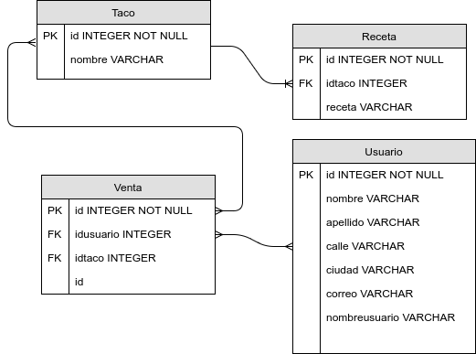

# Proyecto Ordinario. 
## Taquería virtual.
### Descripción.
Se trata de una pequeña aplicación que extrae usuarios de forma aleatoria del siguiente enlace : <https://randomuser.me> y, de igual forma, extrae Tacos con sus recetas del enlace: <http://taco-randomizer.herokuapp.com>. Guarda, tanto usuarios como tacos en una base de datos SQLite, para posteriormente, simular venta de tacos.

### Componentes:
Para el manejo de los datos que se insertan en la tabla de datos se utiliza el archivo: 
```
 tacoCRUD.py
```

Para la extracción de datos tanto la información de los usuarios y las descripciones de las recetas se utiliza el archivo:
```
 recetas.py  y Usuarios.py
```

### Uso.
El arhivo que genera la base de datos es:
```
$ python dbTaco.py
```
el cual creará la base de datos con las tablas necesarias para almacenar la información.
La base de datos se compone de las siguientes tablas:


Ya que se ha creado la base de datos, el usuario puede comenzar a agregar los clientes y tacos necesarios a la base de datos mediante el menú principal, el cual se ejecuta con el comando:
```
$ python tacomain.py
```
y las opciones 5 (Agregar taco)  y 6 (Agregar usuario). Para generar una venta, se consulta el menú de tacos (opcion 3) para buscar el id del taco deseado, así como la lista de usuarios (opción 4) y extraer también el id del usuario deseado. Posteriormente, mediante la opción 1 (Comprar un taco), procedemos a ingresar el id del usuario y el id del taco y así ingresar una venta en la base de datos. Por último, mediante la opción 2 podremos consultar las ventas realizadas.

### Herramientas utilizadas:

Base de datos: SQLite.

ORM: SQLAlchemy.

Scrapping: Beautifulsoup:
librería de Python para extraer datos desde sitios HTML.

SOLID Principle pretendido: Single Responsibility:
Cada clase debe tener una unica responsabilidad

###¿Qué es SQLAlchemy?
SQLAlchemy es un ORM para python. Incluye soporte para SQLite, MySQL, PostgreSQL, Oracle, MS SQL, entre otros.

###¿Qué es ORM?
Sus siglas significan: Object-Relational mapping,(Mapeo Objeto-relacional).
Es una técnica que permite convertir entre los tipos de datos usados en los lenguajes de programación orientados a objetos y los tipos de datos de algún sistema de base de datos relacional.


