# Segundo Parcial

## Ejercicio 1
El comando para correr un contenedor **mysql** con las específicaciones del ejercicio sería el siguiente:

```
docker run --name mysql_db -p 4000:3306 -e MYSQL_USER=foo -e MYSQL_PASSWORD=bar123 -e MYSQL_DATABASE=baz -e MYSQL_ALLOW_EMPTY_PASSWORD=yes -d mysql:8
```

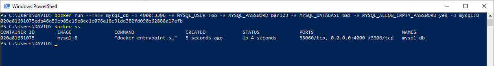

Y los comandos utilizados para conectarnos a la BD dentro del contenedor:

```
docker exec -it mysql_db bin/bash
mysql -u foo -p
```

Colocando la contraseña específicada **bar123**, escribimos `show databases;` para comprobar que efectivamente creamos la BD **baz**.

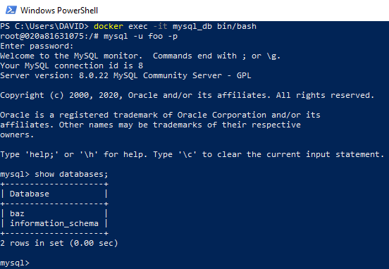


## Ejercicio 2
Los pasos que sigo para resolver el ejercicio:

1. Creo una network llamada **redis-net**.
2. Corro un contenedor llamado **redis** con la versión **6.0.9** de **Redis** _(Conectado en la network **redis-net**)_.
3. Corro un contenedor llamado **commander** con **Redis Commander** _(Conectado en la network **redis-net**)_.

```
docker network create redis-net
docker run -d --name redis --network redis-net redis:6.0.9
docker run --name commander -d -p 80:8081 --network redis-net -e REDIS_HOSTS=redis rediscommander/redis-commander:latest
```

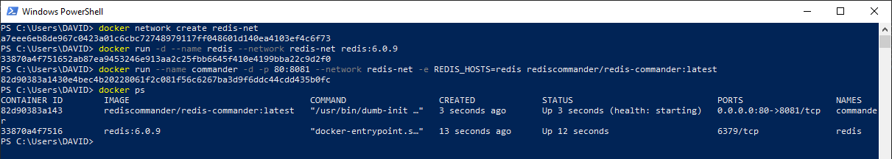

Ahora es posible probar **Redis Commander** por medio del puerto 80.

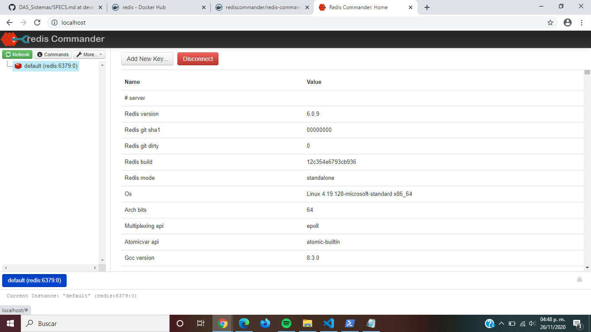


## Ejercicio 3
1. Primero creo el volume **mongo_volume**:
```
docker volume create mongo_volume
```

2. Luego sigo los pasos específicados:
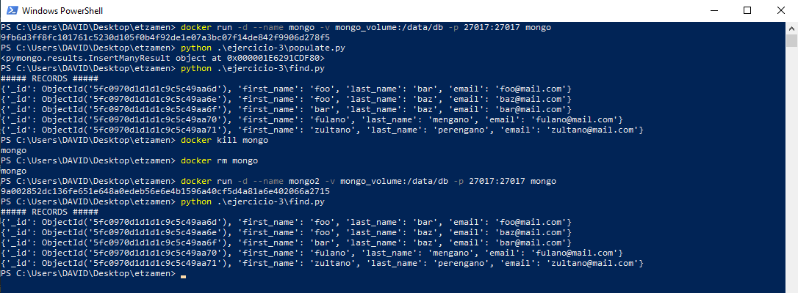

_Guarde la información de la BD del primer contenedor **mongo** en el volume **mongo_volume**, para luego montar otro contenedor apuntando al mismo volume, recuperando la información almacenada._


## Ejercicio 4
_Para ejecutar los siguientes comandos, debe de estar posicionado en este directorio._

### Parte 1 - Imagen & Docker Hub
1. Construyendo la imagen.
```
docker build -t daguirrez/static_flask ./ejercicio-4
```


2. Creo mi repositorio: [https://hub.docker.com/repository/docker/daguirrez/static_flask](https://hub.docker.com/repository/docker/daguirrez/static_flask).

3. Subo mi imagen hacía mi repositorio.
```
docker push daguirrez/static_flask:tagname
```
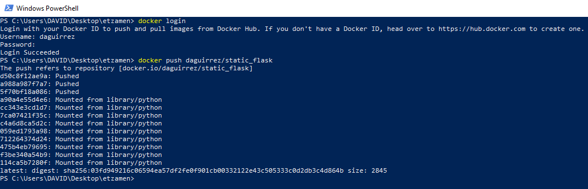

4. Ahora la imagen es accesible para todos.
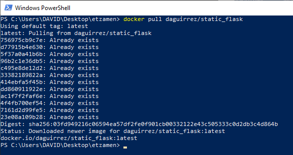

### Parte 2 - Corriendo el contenedor
Corriendo el contenedor llamado **flask** en el puerto **5000**.

```
docker run -d --name flask -p 5000:8000 daguirrez/static_flask
```
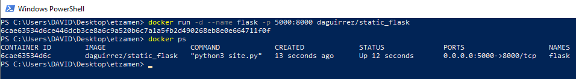

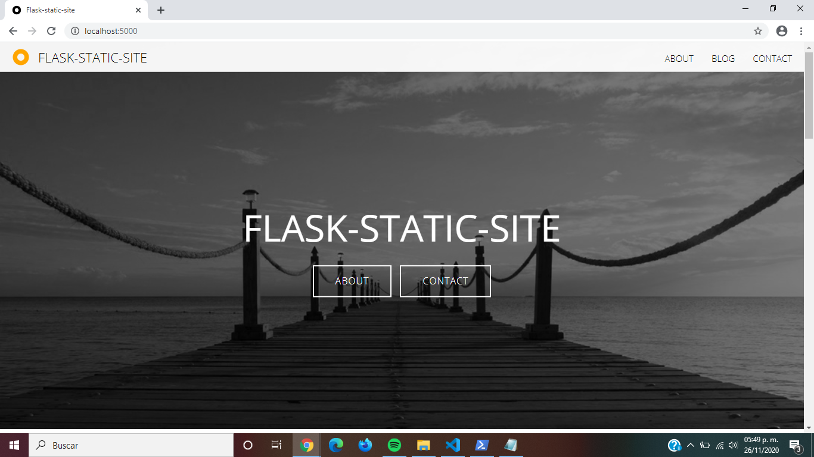


## Ejercicio 5
Siguiendo los pasos solicitados, estos vendrían siendo mis resultados:

1. Monto los contenedores:
```
docker-compose up --build -d
```
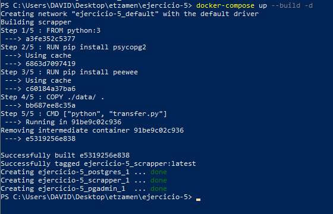

2. En **PgAdmin** se muestran los resultados:
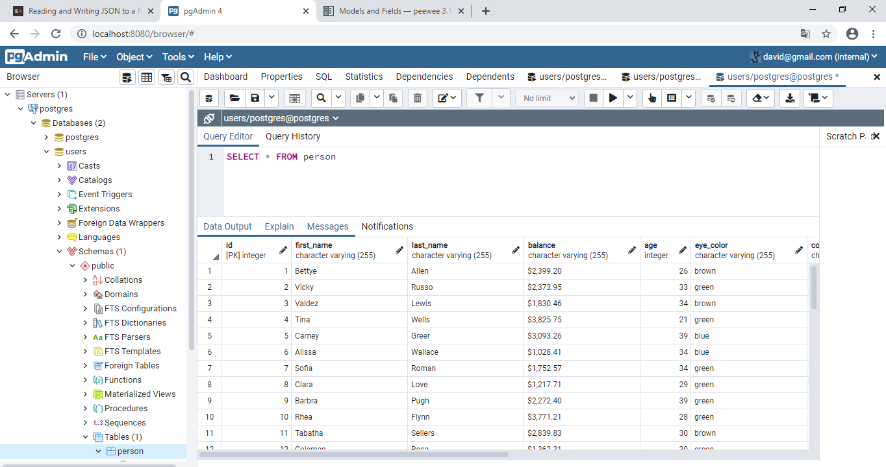
