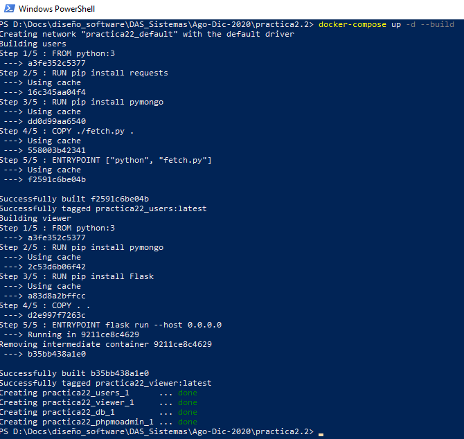
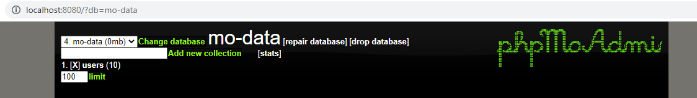
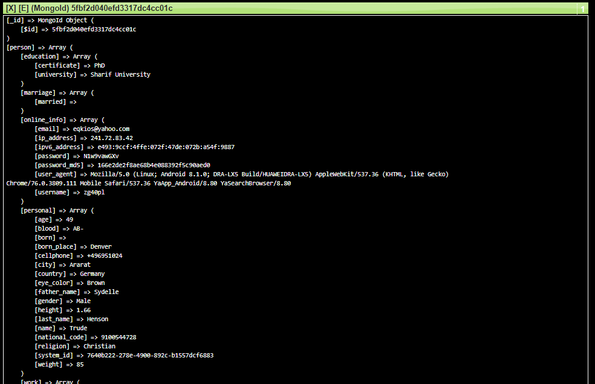
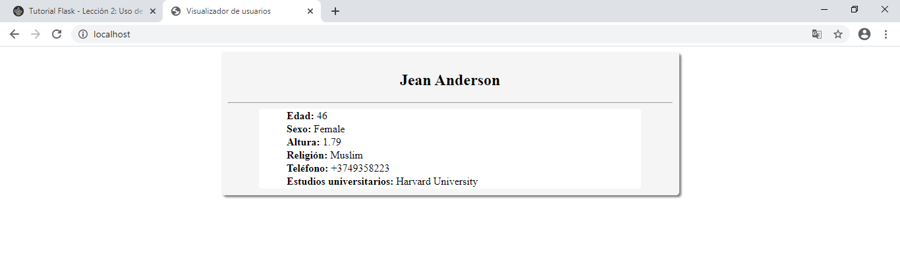
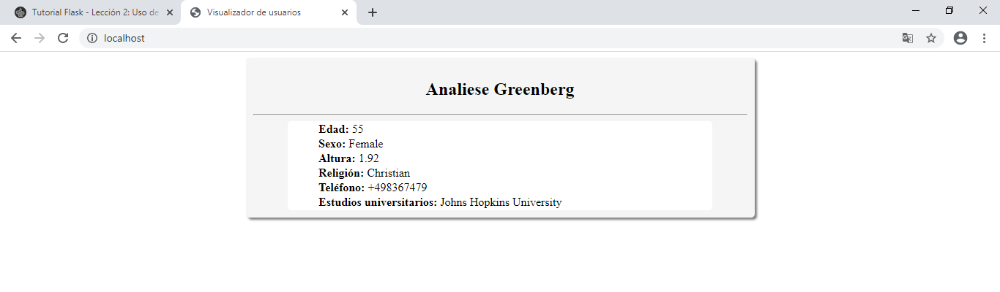

# Práctica 2 - Segundo Parcial

## Práctica
Construyendo el [docker-compose.yml](./docker-compose.yml) y creando **4 contenedores** _(Uno para visualizar la BD)_.

Por motivos de prueba, se empleo **PhpMoAdmin** para comprobar que el **contenedor B** efectivamente guarda los datos.

Insertando un total de **10 usuarios** _(Número definido en la variable de entorno **NUM_USERS** del **contenedor B**)_

Y finalizando con el **contenedor C**, apoyandome del framework **Flask**, muestra un usuario aleatorio cada vez que se envía una petición.

## Experiencia
Me parecío muy emocionante aprender tecnologías nuevas y totalmente distintas a lo que uno se
encuentra acostumbrado _(Docker, Docker Compose y Mongo DB)_.

Le veo muchas ventajas a los contendores como:
- Encapsular proyectos.
- Compartir proyectos de forma efectiva.
- Tener el mismo ambiente en local como en producción.
- Tener distintos contenedores (Para desarrollo, pruebas y producción).

Lo único malo es que la tecnología avanza muy rápido, y por lo visto, apenas empece a ver docker y me entero que ya existen otras tecnologías que podrían "reemplazarlo".
