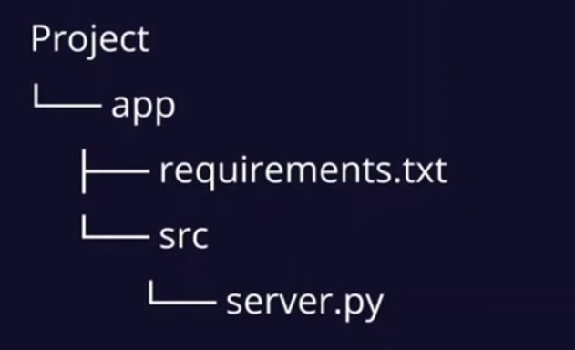
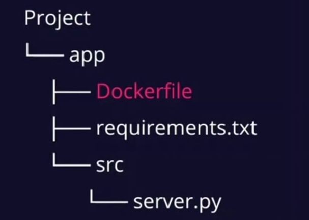

# Síntesis 2 - Conferencia "Best Practices for Compose-managed Python Applications"

Esta conferencia trata de las mejores prácticas para desarrollar proyectos de python en ambientes en contenedores.

### Plan de proyecto 
 
 - Sigue la separación de problemas - Single responsibility principle.
 Consiste en separar la aplicación por partes, una forma de hacer esto es:
 - Parte de la interfaz de usuario
 - Parte lógica / aplicación de python
 - Parte de datos / base de datos.
La razón por la cual se hace la separación es que facilita modificar la aplicación o añadir nuevos módulos y esto evita tener que re-trabajar el proyecto completo.

 ### Estructura del proyecto
 Una buena forma de estructurar los archivos es tener un directorio por servicio.

 Por ejemplo, el directorio de la aplicación de python se vería así:

Ahora para correr esta aplicación se necesita un intérprete de python e instalar las dependencias, hacer esto significa que contaminamos nuestro ambiente estándar y queremos evitar esto. Para poder correr la aplicación sin contaminar el ambiente se usará docker.

Para generar la imagen de la aplicación necesitamos generar la imagen. Para generarla necesitamos generar el dockerfile y añadirlo a nuestro directorio.

Después de generar la imagen se podrá correr en un contenedor usando docker run.

### Mejores práctica para Dockerfiles

- ¿No estás seguro de tus necesidades?
    - Usa la imagen solo especificando la versión que vas a usar ej.
        - ``python:<version>``

- Optimización final de la imagen
    - Para reducir como sea posible en algunos casos se puede usar el tag de alpine ej.
        - ``python:<version>-alpine``

- Primero copia el archivo de dependencias e instalalo, esto toma ventaja de los build caches para reducir futuros tiempos de construcción de la imagen.
    - Es recomendado añadir instrucciones para capas que no se actualizan frecuentemente antes de las que son actualizadas con frecuencia.

- Copia los archivos del código fuente y corre la aplicación.

Para añadir la base de datos y la UI se usará Docker compose.

### Mejores prácticas para archivos Compose

- Definir redes separadas para cada par de componentes.
- Definir volúmenes para datos de base de datos persistente.
- Definir secretos para pasar de manera segura credenciales/contraseñas de a los servicios.

