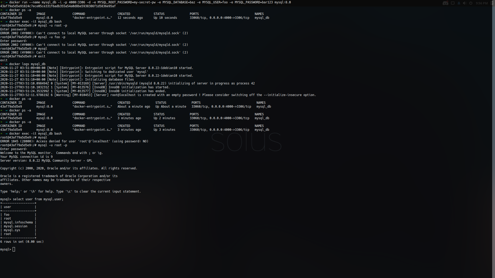
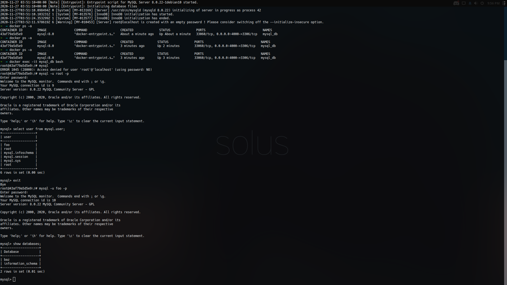
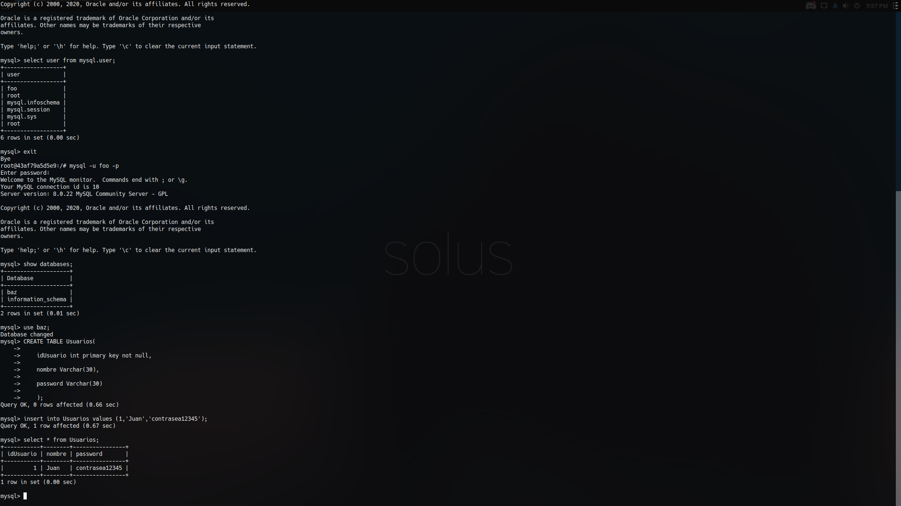
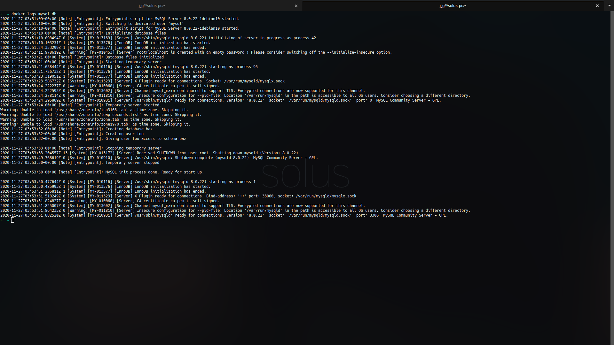

# Ejercicio 1 - 2do Parcial DAS
Nota: Si docker necesita sudo, pongalo antes de los comandos.
 
Nota 2: Al realizar esta práctica a MySQL le tomaba de 2 - 3 minutos inicializarse, durante este periodo de tiempo la base de datos era inútil, después de que pasara ese rango de tiempo, ya funcionó como debería. En las evidencias esto se puede notar en la primera captura. Como parte de las evidencias se adjuntó una captura con los logs del contenedor.
 
El siguiente comando crea el contenedor con las características solicitadas:
```sh
docker run --name mysql_db -i -p 4000:3306 -d -e MYSQL_ROOT_PASSWORD=my-secret-pw -e MYSQL_DATABASE=baz -e MYSQL_USER=foo -e MYSQL_PASSWORD=bar123 mysql:8.0
```
Podemos verificar si el contenedor está corriendo con el siguiente comando:
```sh
docker ps -a
```
Para entrar al contenedor se corre el siguiente comando:
```sh
docker exec -it mysql_db bash
```
Dentro del contenedor existen 2 formas de acceder a mysql, como root o cómo el usuario creado previamente:
```sh
mysql -u root -p
 
mysql -u foo -p
```
Después de ingresar uno de estos comandos solicitará la contraseña y después de darsela ya podremos usar mysql
 
Si desea checar los usuarios registrados use el comando (Tienes que ser root para usar este comando):
```SQL
select user from mysql.user;
```
Si desea checar las bases de datos use el comando:
```SQL
show databases;
```
Para usar la base de datos hecha en los parámetros use el comando
```SQL
use baz;
```
Ahora haremos una query sencilla:
```SQL
   CREATE TABLE Usuarios(
   idUsuario int primary key not null,
  
   nombre Varchar(30),
  
   password Varchar(30)
  
   );
 
   insert into Usuarios values (1,'Juan','contraseña12345');
 
   select * from Usuarios;
```
 
Evidencias:
 
1. 
2. 
3. 
- Logs: 
 
 

