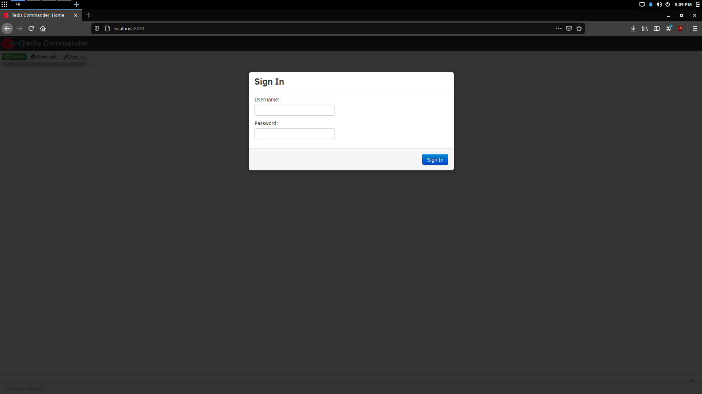
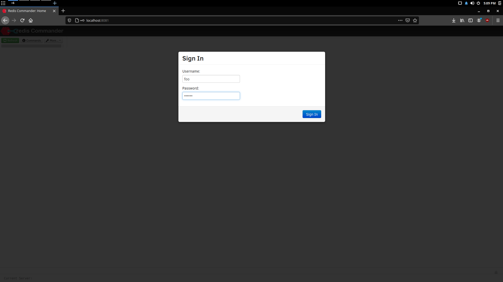
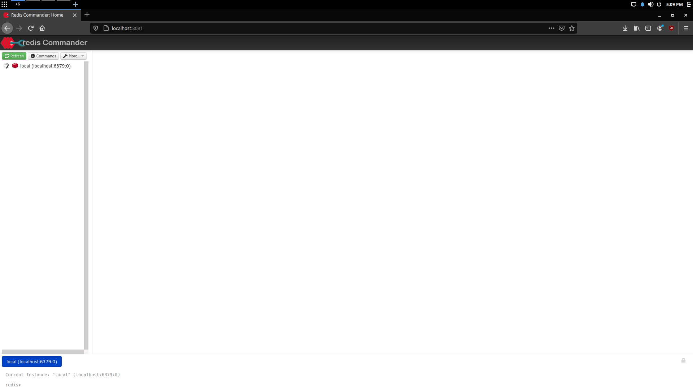
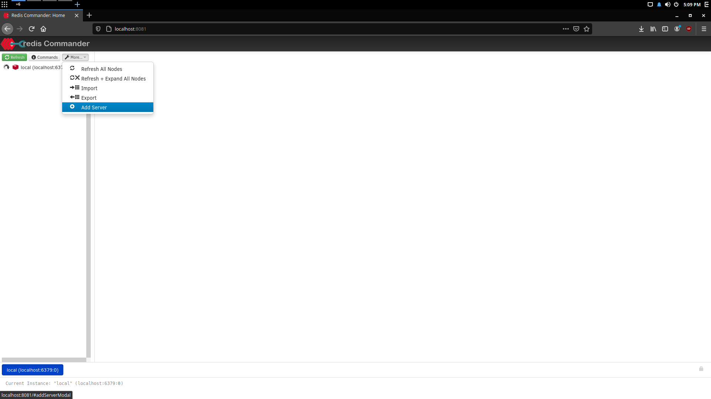
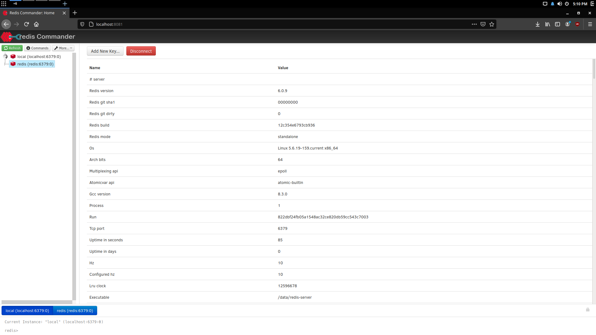
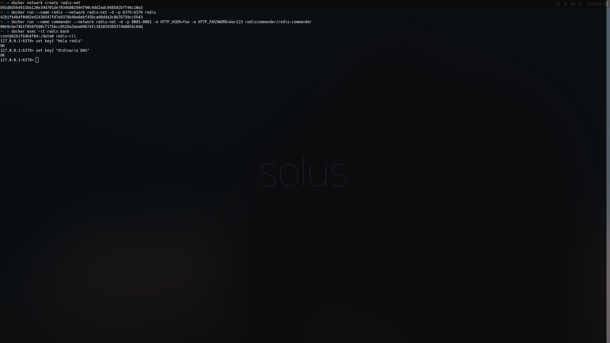
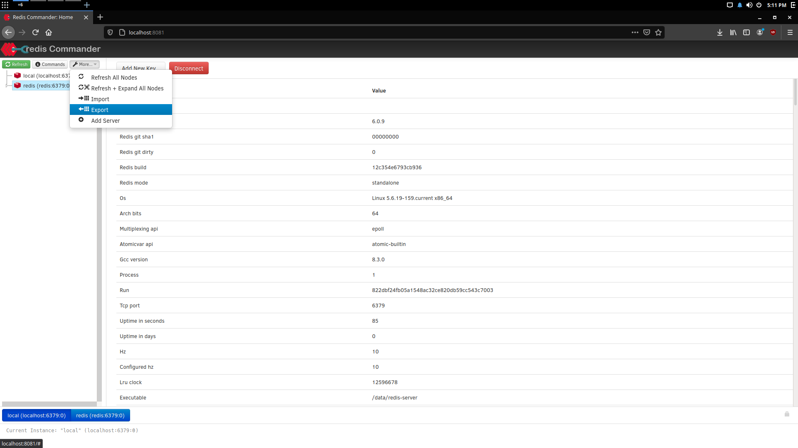
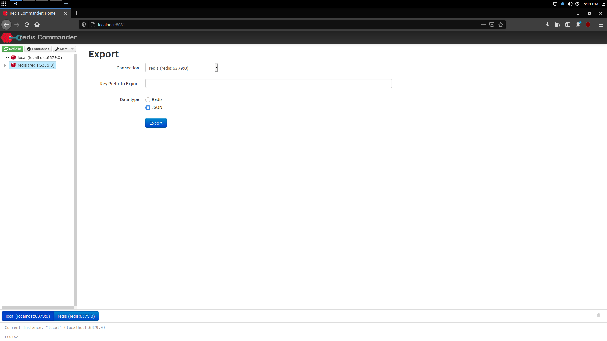
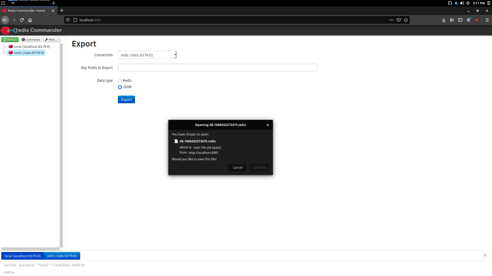
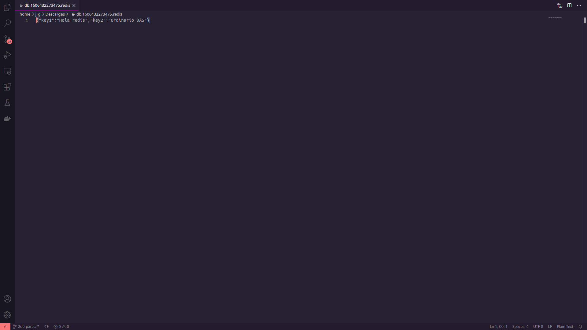

# Ejercicio 2 - 2do Parcial DAS
 
Primero se crea una red de docker:
```sh 
docker network create redis-net
 ```
Para crear el contenedor de redis se ejecuta el siguiente comando:
```sh
docker run --name redis --network redis-net -d -p 6379:6379 redis
 ```
Para crear el contenedor de redis-commander
```sh
   docker run --name commander --network redis-net -d -p 8081:8081 -e HTTP_USER=foo -e HTTP_PASSWORD=bar123 rediscommander/redis-commander
 ```
Entra a la dirección [http://localhost:8081/](http://localhost:8081/)
 
Dentro de redis commander añade el server, more>add server...
Y los valores que añadiremos son:
- DisplayName: redis
- Hostname or Unix Socket Path: redis
y finalmente damos en connect y aparecerá nuestro server.
 
Si deseas probar que funcione puedes añadir llaves desde el redis-cli del contenedor de redis y exportarlas desde el commander usa estos comandos en el contenedor de redis:
```sh
   docker exec -it redis bash
   redis-cli
   set key1 "Hola redis"
   set key2 "Ordinario DAS"
```
Desde redis-commander usar la opción de export (Se encuentra en More...>Export), en el campo de connection seleccionamos nuestra conexión redis y usamos el data type de JSON, después de exportar el archivo, este se puede abrir con un editor de texto. El archivo debe contener lo siguiente:
 ```json
   {"key1":"Hola redis","key2":"Ordinario DAS"}
 ```
Evidencia:
 
1. 
2. 
3. 
4. 
5. 
6. 
7. 
8. 
9. 
10. 
11. 
12. 
13. [Archivo de redis](db.1606432273475.redis)

