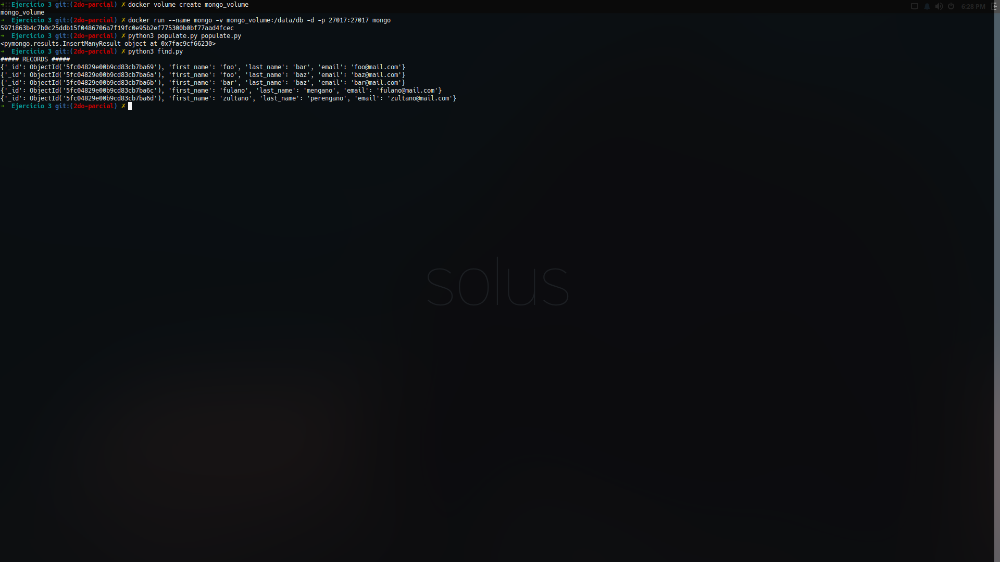
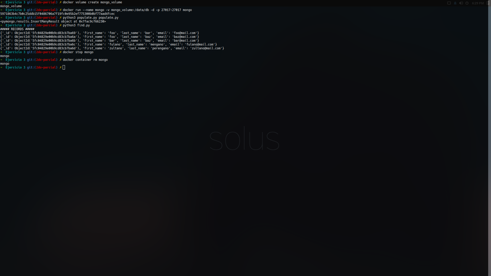
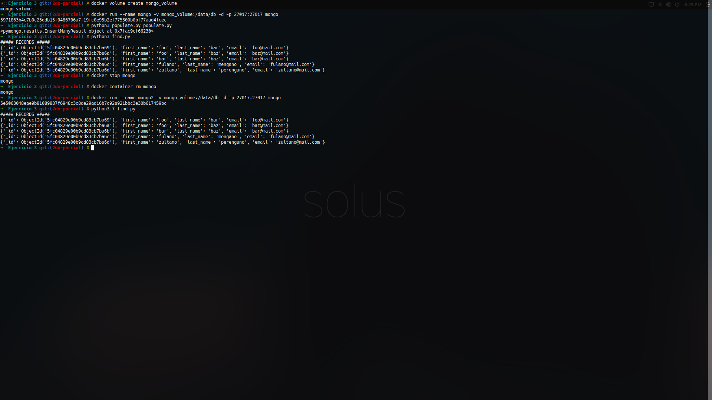

# Ejercicio 3 - 2do Parcial DAS

Primero se crea el volumen:
    
```sh
docker volume create mongo_volume
```

Después se crea el contenedor:

```sh
docker run --name mongo -v mongo_volume:/data/db -d -p 27017:27017 mongo
```

Ahora se corren los archivos:
```sh
python3 populate.py
python3 find.py
```

El resultado de find.py fue:
```sh
##### RECORDS #####
{'_id': ObjectId('5fc03f682f86288157d39d27'), 'first_name': 'foo', 'last_name': 'bar', 'email': 'foo@mail.com'}
{'_id': ObjectId('5fc03f682f86288157d39d28'), 'first_name': 'foo', 'last_name': 'baz', 'email': 'baz@mail.com'}
{'_id': ObjectId('5fc03f682f86288157d39d29'), 'first_name': 'bar', 'last_name': 'baz', 'email': 'bar@mail.com'}
{'_id': ObjectId('5fc03f682f86288157d39d2a'), 'first_name': 'fulano', 'last_name': 'mengano', 'email': 'fulano@mail.com'}
{'_id': ObjectId('5fc03f682f86288157d39d2b'), 'first_name': 'zultano', 'last_name': 'perengano', 'email': 'zultano@mail.com'}
```
Ahora se borra el contenedor original:
```sh
docker stop mongo
docker container rm mongo
```
Ahora se levanta un segundo contenedor:
```sh
docker run --name mongo2 -v mongo_volume:/data/db -d -p 27017:27017 mongo
```
Y se ejecuta de nuevo find.py, el resultado es:
```sh
python3 find.py
##### RECORDS #####
{'_id': ObjectId('5fc04829e00b9cd83cb7ba69'), 'first_name': 'foo', 'last_name': 'bar', 'email': 'foo@mail.com'}
{'_id': ObjectId('5fc04829e00b9cd83cb7ba6a'), 'first_name': 'foo', 'last_name': 'baz', 'email': 'baz@mail.com'}
{'_id': ObjectId('5fc04829e00b9cd83cb7ba6b'), 'first_name': 'bar', 'last_name': 'baz', 'email': 'bar@mail.com'}
{'_id': ObjectId('5fc04829e00b9cd83cb7ba6c'), 'first_name': 'fulano', 'last_name': 'mengano', 'email': 'fulano@mail.com'}
{'_id': ObjectId('5fc04829e00b9cd83cb7ba6d'), 'first_name': 'zultano', 'last_name': 'perengano', 'email': 'zultano@mail.com'}
```

**Vuelve a ejecutar el script de find.py y contesta a la siguiente pregunta: ¿Cuál fue nuestra salida en está ocasión?**

-Fue la misma salida que cuando se ejecutó en el contenedor mongo, esto se debe al uso de volumes.

Evidencias:
1.  
2.  
3.  