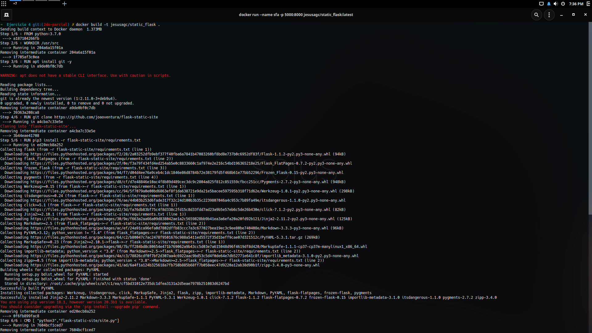
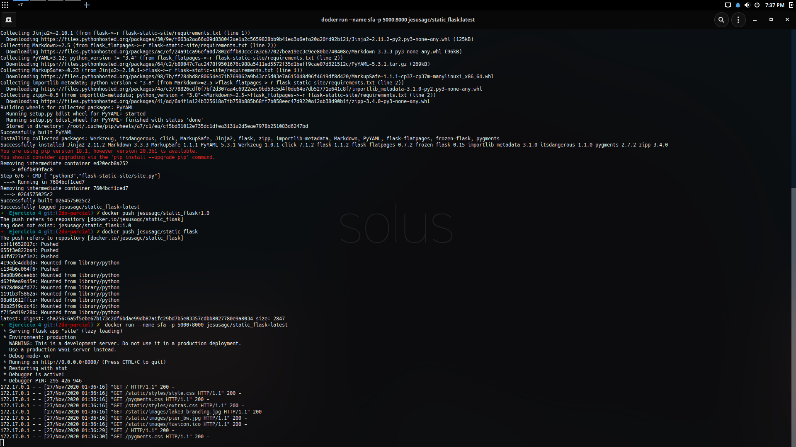
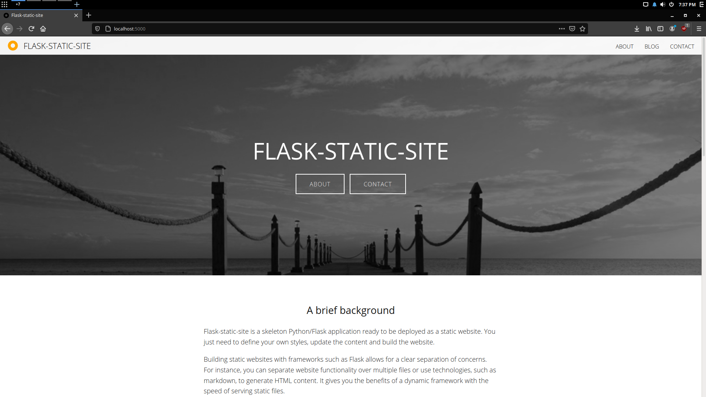
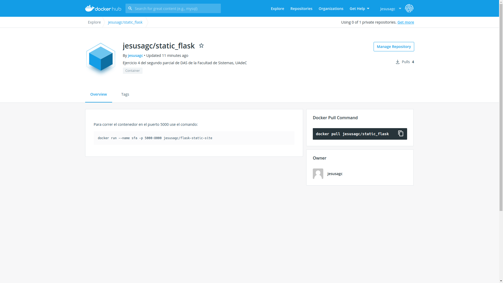

# Ejercicio 4 - 2do Parcial DAS

En el caso de usar un dockerfile use el siguiente comando:
```sh
docker build -t jesusagc/flask-static-site .
```
También se puede bajar desde docker hub
```sh
docker pull jesusagc/static_flask:latest
```
Después de obtener la imagen ahora se ejecutará el sitio web en el puerto 5000 usando el siguiente comando:
```sh
 docker run --name sfa -p 5000:8000 jesusagc/static_flask:latest
 ```
 Ir a [http://localhost:5000/](http://localhost:5000/) para ver la imagen corriendo.

 Evidencias:
 
1.  
2.  
3.  
4.  

URL de dockerhub: [jesusagc/static_flask](https://hub.docker.com/r/jesusagc/static_flask)