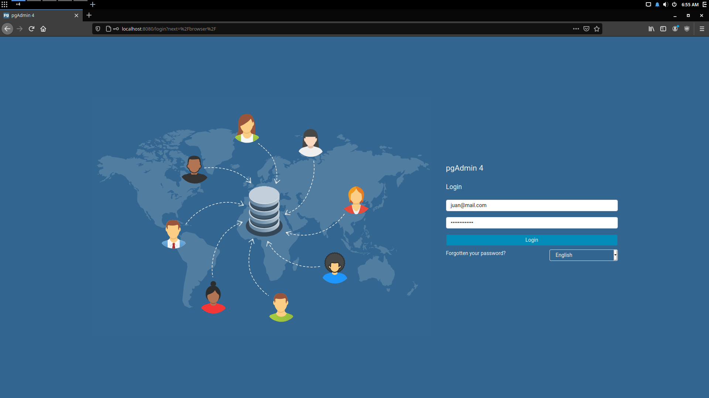
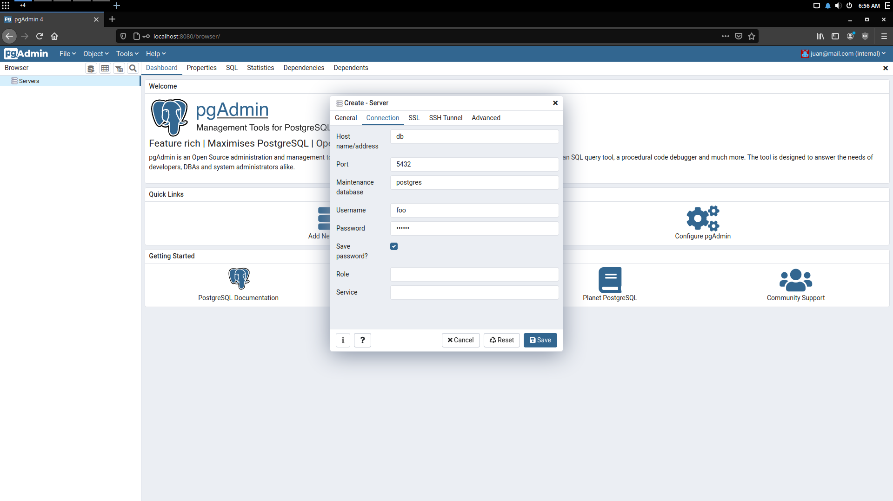
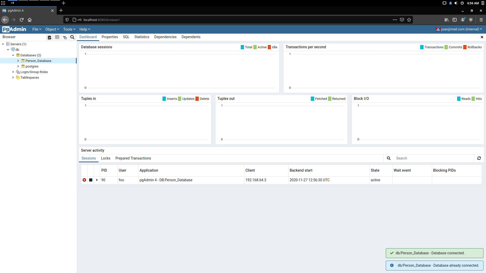
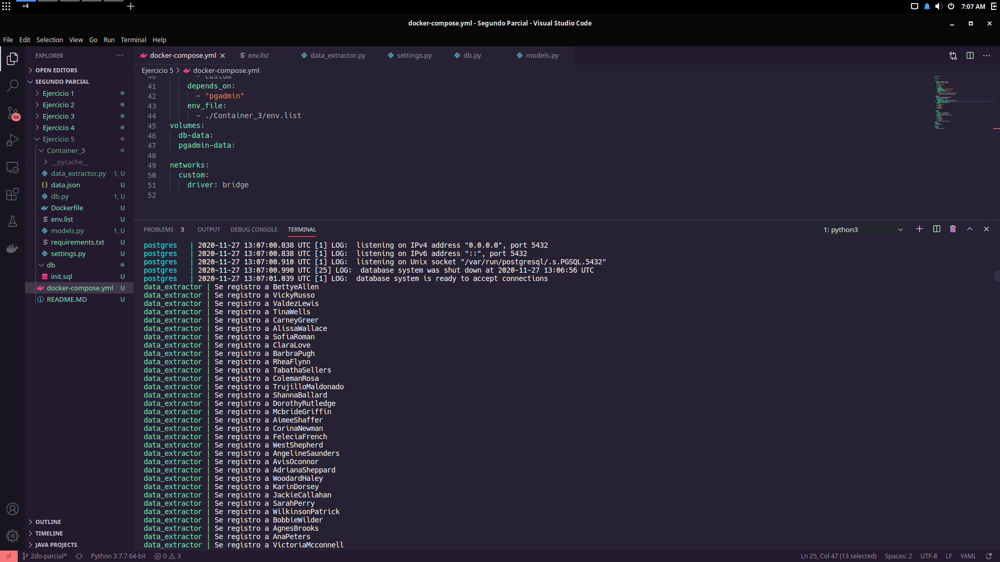
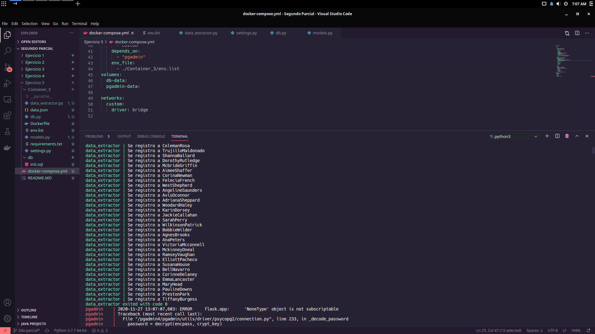

# Ejercicio 5 - 2do Parcial DAS

Dentro de esta carpeta ejecuta el siguiente comando para ejecutar el software:
```sh
docker-compose up
```
Nota: A veces falla, en este caso, solo use Ctrl+C y repita el comando anterior.

Evidencias:
1. 
2. 
3. 
4. 
5. 