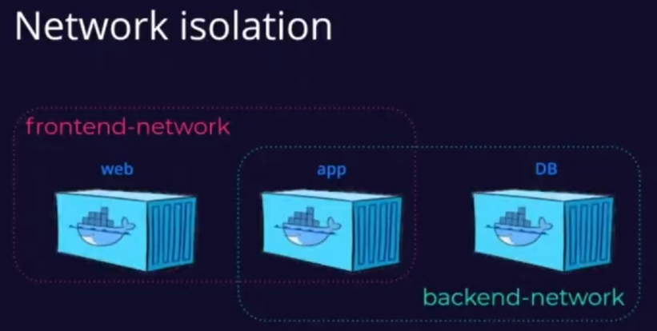

# Práctica 8 | Dockercon2020  | 17284052

## Best Practices for Compose-managed Python Applications 
----
  - [DockerFiles Best Practices](#dockerfiles-best-practices)
  - [Docker Compose Best Practices](#docker-compose-best-practices)
----

### DockerFiles Best Practices

Los Dockerfile son el punto de partida para crear una imagen Docker. Es muy importante crear bien el Dockerfile para que la imagen resultante sea segura, pequeña, rápida de construir y rápida de actualizar.


#### Aprovechar el cache
El constructor de Docker almacena en caché el resultado de cada paso como una capa de imagen, el caché puede ser invalidado haciendo que el paso que invalidó el caché y todos los pasos subsiguientes necesiten ser ejecutados de nuevo y las capas correspondientes sean regeneradas.

El caché se invalida cuando cambian los archivos en el contexto a los que se hace referencia por COPY o ADD. Por lo tanto, el orden de los pasos importa mucho en el momento de escribir nuestro DockerFile

Aprovechar el caché de construcción significa que es una mejor idea instalar primero los requirements u otros archivos estáticos similares, antes que el código src, que a menudo recibe más cambios.

**DockerFile que no utiliza bien el cache**
```Docker
FROM node:lts

ENV CI=true
ENV PORT=3000

WORKDIR /code
COPY . /code
RUN npm ci

CMD [ "npm", "start" ]
```

**Version mas optimizada**
```Docker
FROM node:lts

ENV CI=true
ENV PORT=3000

WORKDIR /code
COPY package.json package-lock.json /code/
RUN npm ci
COPY src /code/src

CMD [ "npm", "start" ]
```

#### De ser necesario, usar la "construccion por steps":

En caso de que las dependencias al momento de desarrollo, sean diferentes a las dependencias en runtime, es buena idea hacer un *Multi-stage build*, en donde hay varios FROM, identificados con un tag

**Ejemplo:**
```DockerFile
FROM node:13.12.0 AS development

ENV CI=true
ENV PORT=3000

WORKDIR /code
COPY package.json package-lock.json /code/
RUN npm ci
COPY src /code/src

CMD [ "npm", "start" ]

FROM development AS builder

RUN npm run build

FROM nginx:1.17.9 AS production

COPY --from=builder /code/build /usr/share/nginx/html
```
### Docker Compose Best Practices

#### Network Isolation



Ninguna red definida es una mala práctica, todos los servicios no deben ser colocados en la misma red, idealmente. Para tener más control.  En el ejemplo, no hay razón para que el contenedor de la red pueda teóricamente llegar a la base de datos

#### Montar el código fuente en el contenedor Docker ejecutando el servicio

```yaml
version: "3.7"
services:
    app:
        build: app
        volumes:
            - ./app/src:/src

```

Cuando sea posible, y en desarrollo, es buena idea cargar el codigo fuente como volumen en el contenedor, es decir, configurar el dockerfile de tal forma de que este atento observando en cambios en el codigo. De esta manera no es necesario reconstruir la imagen del contenedor cada vez que se quiera hacer un cambio

#### Docker secrets

Los secrets son conjuntos de datos, como una contraseña, una clave privada SSH, un certificado SSL u otro tipo de datos que no deben ser transmitidos a través de una red o almacenados sin cifrar en un Dockerfile o en el código fuente de su aplicación. Se pueden utilizar los secretos de Docker para gestionar estos datos de forma centralizada y transmitirlos de forma segura sólo a aquellos contenedores que necesitan acceso a ellos