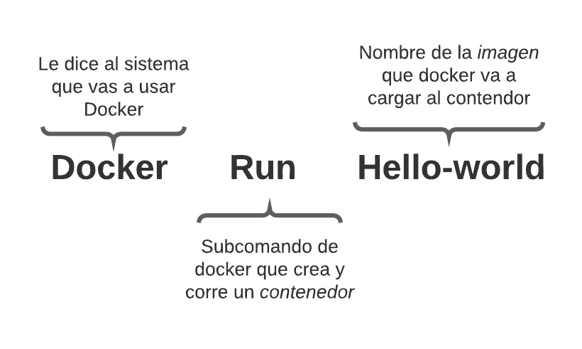

# Práctica 8 | Dockercon2020  | 17284052

## How to get started with Docker
----
  - [Por que usar Docker?](#docker)
  - [DockerFiles](#dockerfile)
----

### Docker
Antes de docker, configurar y *"deployear"* era una historia interminable de instalación y configuración, llena de errores dificiles de troubleshootear

Si existia un error, se tenia que retirar el servidor de produccion para arreglarlo,

Era tardado y poco portable, ¿Y si pudiéramos agrupar todo el código de nuestra aplicación, los binarios de soporte y la configuración y sólo lo hiciéramos una vez?

Los contenedores nos permiten eso. Es un cambio de ver a los servidores como algo longevo y duradero, a algo efemereo y facil de cambiar si algo sale mal

**Ejemplo de workflow en docker:**

|  **BUILD**: | **SHIP**:  | **SHIP**:  |
| ----------- | ----------- | -----------
| Empaquetar consistentemente todo lo que tu aplicación necesita para funcionar     | Enviar facilmente estas imágenes a la nube o a otras máquina de development     |  Ejecutar fácil y *consistentemente* las aplicaciones   |

Docker nos permite la creacion de ambientes de desarrollo *predecibles* y consistentes.
Al empaquetar todas las dependencias que un programa podria tener, Docker nos ofrece una manera de empaquetamiento logico en donde las aplicaciones pueden ser abstraidas del ambiente en donde realmente son ejecutadas

### DockerFile

Un DockerFile es una lista de comandos enviados al motor de Docker, que los interpreta y construye una imagen a partir de los comandos.

la imagen es un ejemplo sencillo para correr una imagen, sin embargo los comandos dentro de las dockerfiles son diferentes

Entre los comandos para dockerfiles mas comunes estan:

> **FROM:**  Establece la imagen base desde donde se va a construir

> **COPY:**  Copia los archivos de un lugar en el host hacia el propio sistema de archivos del contenedor en el destino establecido.

> **ENV:**  Establece variables de entorno

> **CMD:**  Proporciona el comando por defecto que corre un contenedor al ser ejecutado.

> **WORKDIR:**  Establece el directorio de trabajo para cualquier instrucción RUN, CMD, ENTRYPOINT, COPY y ADD que la siga en el Dockerfile

Las imágenes están en capas, lo que significa que puedes construir a partir de una imagen oficial, y construir sobre ella, o una de tus imágenes personalizadas anteriores

Esto permite un fácil control de versiones, y la habilidad de probar fácilmente el software y las configuraciones 
