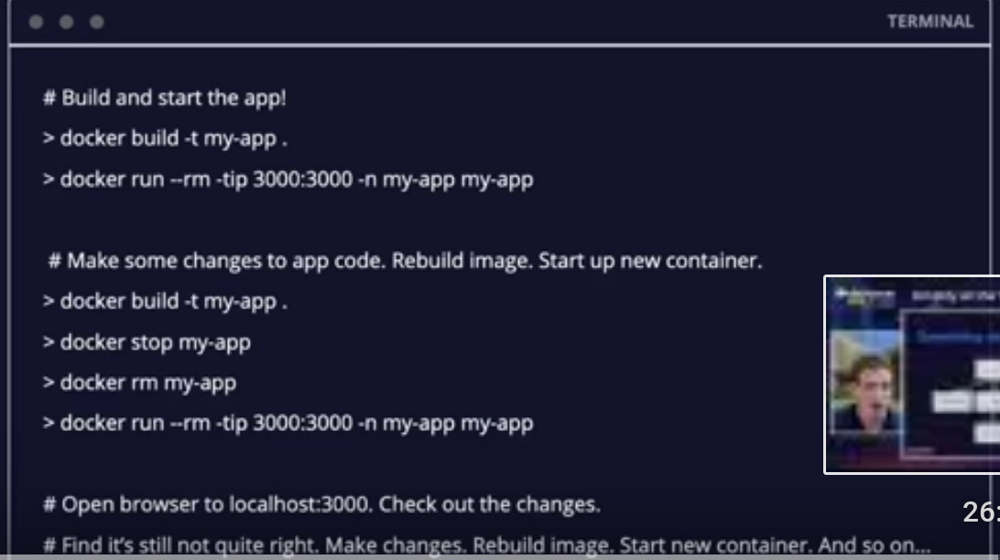
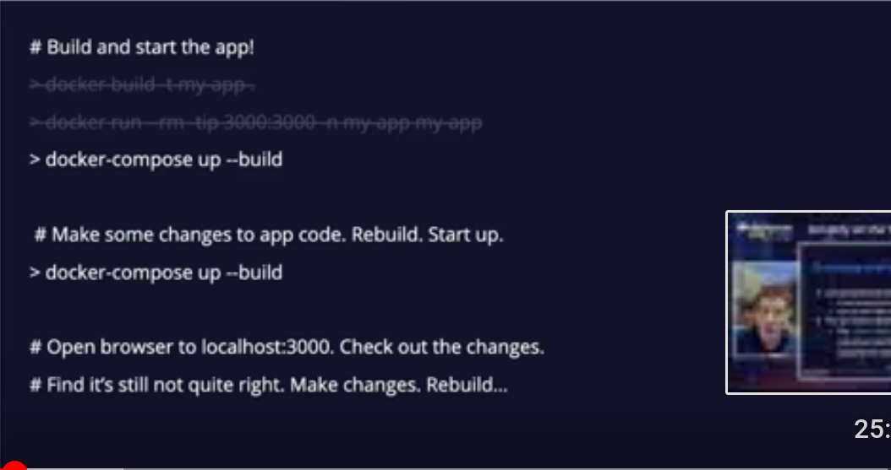
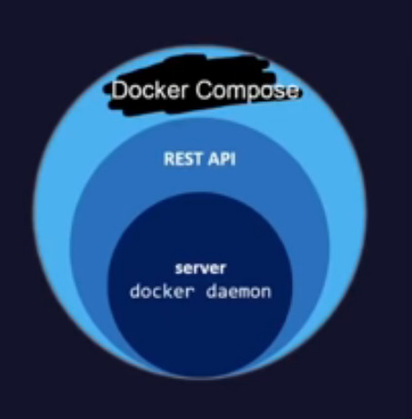

# Práctica 8 | Dockercon2020  | 17284052

## Simplify All the Things with Docker Compose 
----
  - [Workflows](#workflows)
  - [Docker Compose](#docker-compose)
----

### Workflows

Al principio del video explican como un equipo hipotetico, trabaja antes de conocer sobre docker-compose y despues de conocer sobre docker compose, lo pongo aqui en el resumen, por que fue exactamente igual a como me paso a mi

**Sin Docker-Compose**:
  

**Con Docker-Compose**: 
     | 

Es evidente cual workflow es mucho mas sencillo y eficiente

### Docker Compose

Una forma de entender mejor como funciona Docker compose, es como lo explicaron en el video.

El daemon de docker es en realidad sólo un RESTful api que corre en:

> var/run/docker.sock

Esto hace más fácil entender, que Docker Compose es sólo una herramienta de mas alta abstracción, en lugar de usar el CLI, que nos permite manejar múltiples contenedores usando archivos YAML

* Docker compose puede ser usado para simplificar enormemente los entornos de desarrollo
	1. git clone
	2. docker-compose
	3. Escribir Codigo

* Con Compose, puedes facilmente aniadir servicios segun sea necesario
* Compose puede ser usado para integracion continua facilmente, ya que el end to end testing solo seria visto como un servicio mas
