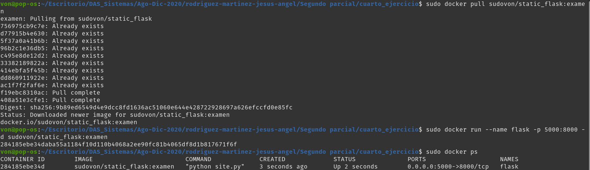
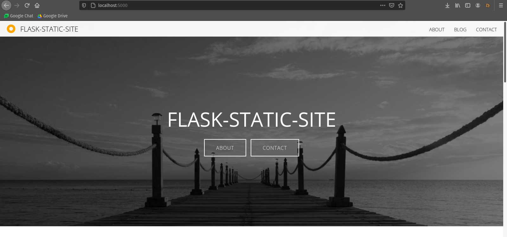
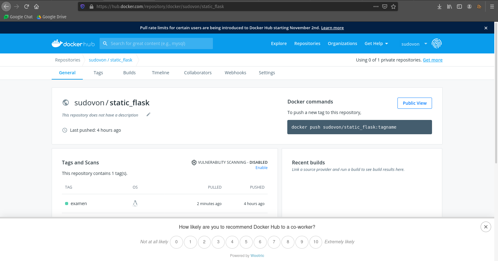

# Cuarto ejercicio

- sudo docker build -t sudovon/static_flask .
- sudo docker run -d --name static_flask -p 8000:8000 sudovon/static_flask
- sudo docker login
- sudo docker tag sudovon/static_flask sudovon/static_flask:examen
- sudo docker push sudovon/static_flask:examen
- sudo docker pull sudovon/static_flask:examen
- sudo docker run --name flask -p 5000:8000 -d sudovon/static_flask:examen
- sudo docker ps

# Links:
- https://hub.docker.com/r/sudovon/static_flask
- http://localhost:5000/

