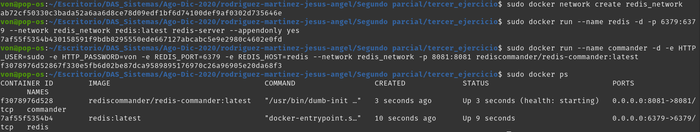
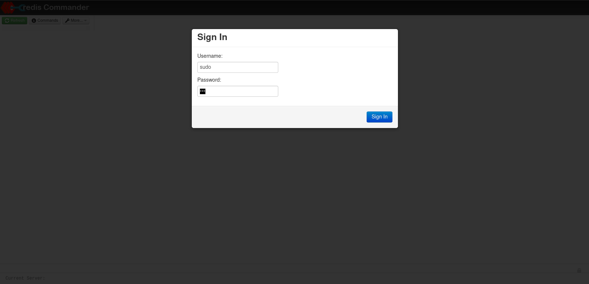
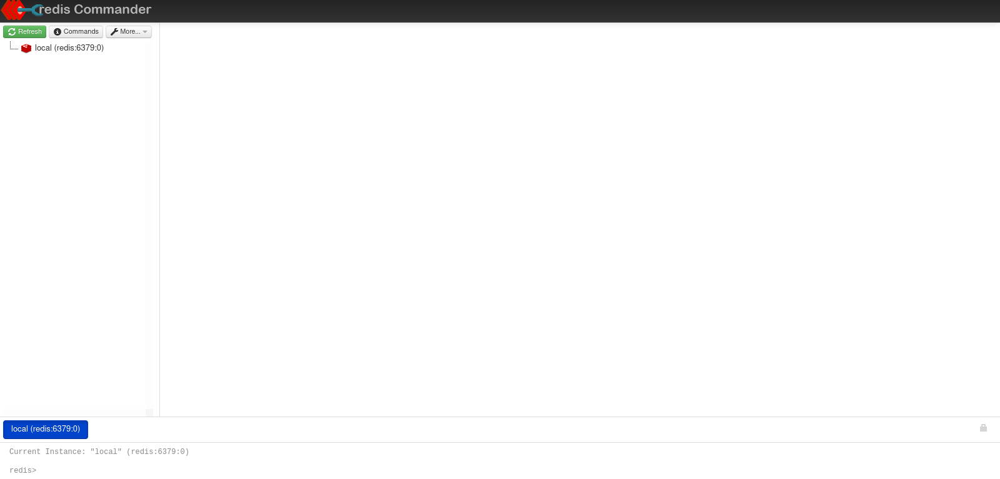
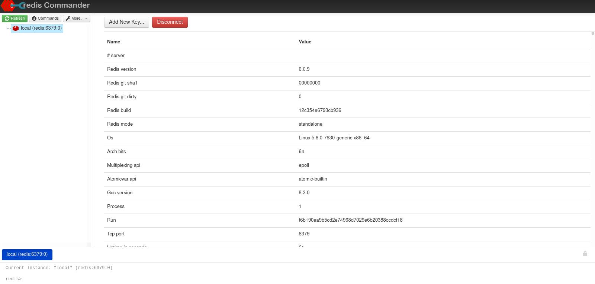

# Segundo ejercicio

Lista de comandos: 
- sudo docker network create redis_network
- sudo docker run --name redis -d -p 6379:6379 --network redis_network redis:latest redis-server --appendonly yes
- sudo docker run --name commander -d -e HTTP_USER=sudo -e HTTP_PASSWORD=von -e REDIS_PORT=6379 -e REDIS_HOST=redis --network redis_network -p 8081:8081 rediscommander/redis-commander:latest
- sudo docker ps

## Evidencias

