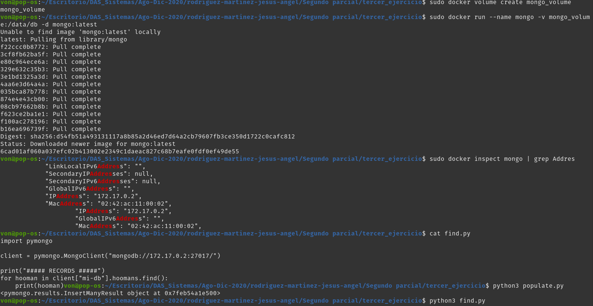
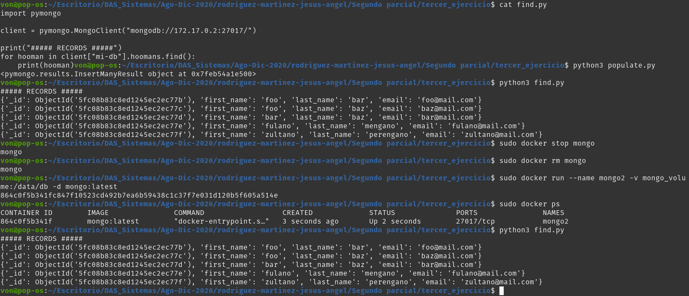

# Tercer ejercicio

- sudo docker volume create mongo_volume
- sudo docker run --name mongo -v mongo_volume:/data/db -d mongo:latest
- sudo docker inspect mongo | grep Addres
- cat find.py
- python3 populate.py
- python3 find.py
- sudo docker stop mongo 
- sudo docker rm mongo
- sudo docker run --name mongo2 -v mongo_volume:/data/db -d mongo:latest
- sudo docker ps
- python3 find.py

## Comentarios:
Los datos se mantenieron intactos porque lo que se eliminó fue el contenedor, no el volumen, por lo que 
al volver a crear el contenedor y mantener el mismo volumen este se conservó junto a los datos.
Si lo que se busca es que se borren los datos habría que hacer lo siguiente después de apagar el contenedor:
sudo docker volume rm mongo_volume

## Evidencias

