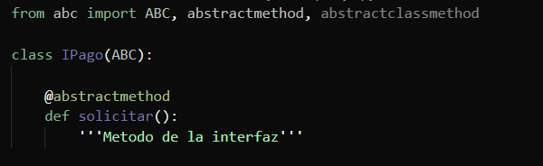
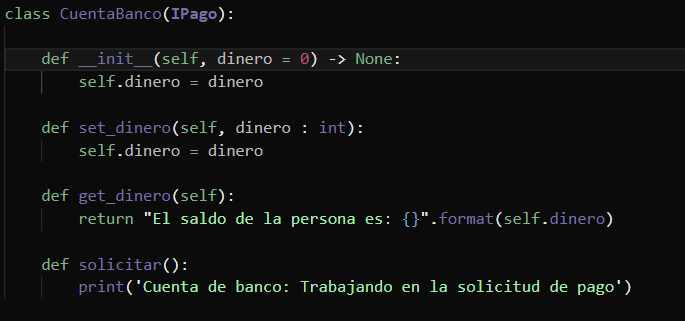
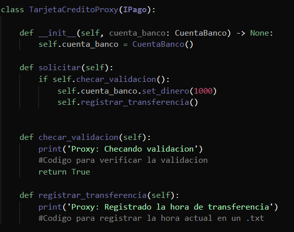
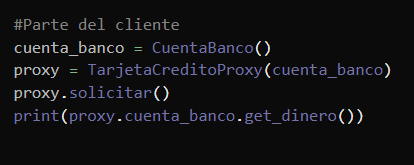
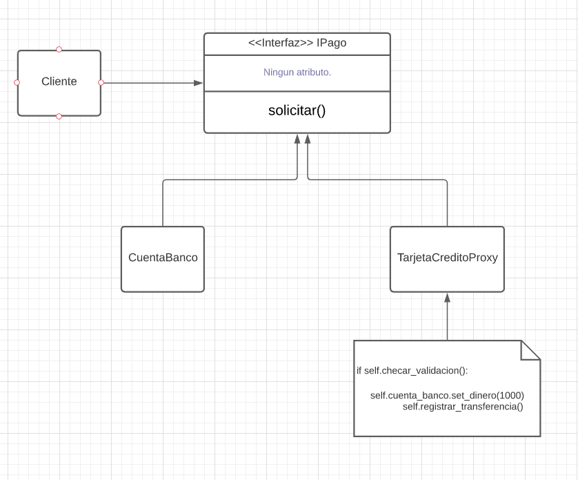

# 1.- Sintésis sobre lo comprendido acerca del patrón de diseño

Proxy es un patrón de diseño estructural que permite proporcionar un sustituto o marcador de posición para otro objeto. Un proxy controla el acceso al objeto original, lo que le permite realizar algo antes o después de que la solicitud llegue al objeto original.
Algun un ejemplo que quise implementar fue el de un banco, tomando en cuenta la definición anterior, una tarjeta de credito es un proxy para una cuenta de banco, que a la ez tambien es un proxy para una cantidad de dinero. Ambos implementan la misma interfaz, se usan para hacer pagos. Entonces un resumen de esto es que una tarjeta de credito actua como un intermediario, para asi no hacer los cambios indemediatamente en el saldo de la persona.

# 2.- Descripción del ejemplo implementado, desde el problema hasta la forma de implementar la solución y el por qué

El ejemplo implementado como se menciono anteriormente, fue la de una banco. El problema es que al hacer depositos o transferencias no se afecte directamente el saldo de nosotros o al de la otra persona, sin antes haber un intermediario entre estos dos, asi que se decidio crear una tarjeta de credito como proxy, para asi afectar a la cuenta de banco de la otra persona o la nuestra. Se empezo creando la interfaz IPago con el metodo solicitar, la clase CuentaBanco la cual tiene metodos escenciales para checar nuestro saldo, nuestro proxy la clase TarjetaCreditoProxy, y finalmente nuestro cliente.

# 3.- Diagrama UML del ejemplo implementado (puede ser desde una foto de un diagrama UML a mano hasta un UML generado a través de alguna herramienta de software en concreto)

# 4.- Recursos desde los cuáles estudiaste, investigaste e implementaste el patrón

https://refactoring.guru/design-patterns/proxy

https://www.tutorialspoint.com/design_pattern/proxy_pattern.htm

https://www.youtube.com/watch?v=cHg5bWW4nUI&ab_channel=DerekBanas