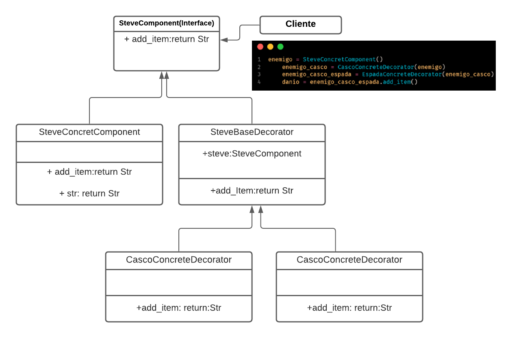
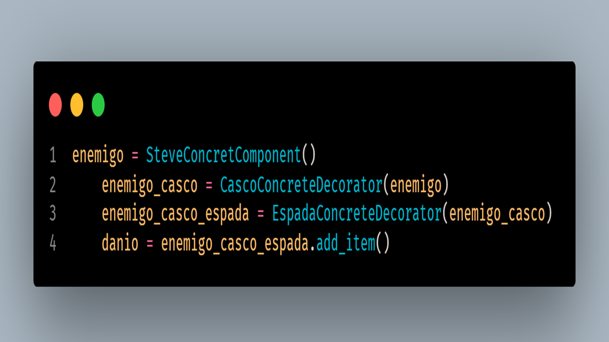

# _Sintesis de lo comprendido del patron de diseño_

Este patron de diseño es super útil ya que permite añadirle **funcionalidades** a un objeto, y asi hacer crecer el objeto con nuevas funcionalidades de una manera sencilla, tambien se puede mantener de una forma sencilla.
este patron permite definir todas las posibles soluciones de forma dinamica mediante los `decoradores.`

Una analogaia podria ser que es como una cebolla esta definido por capas, cada capa tiene su funcion cada capa es un decorador y cada capa se comunica con una capa interior

## Descripción del ejemplo

* El ejemplo traba de un personaje de un videojuego
que al principio inicia siendo un personaje basico, pero confirme se le agregan items que hacen que el personaje tenga mas `habilidades`, le agregue `caso` y `espada` **(defensa y ataque)**.

* La forma en que la implemente fue que el personaje base sea el steve concreto el por defecto y la forma de cambiar las habilidades de este fue mediante el casco y la espada, que llegaron a ser los decoradores para añadirle funcionalidad al personaje

# _Recursos:_

 
___

 

___

* [video de youtube sobre Patron dediseño decorator][video_1]

* [video de youtube sobre Patron de diseño decorator][video_2]

* [Patron decorator Refactoring guru][Refactoring]

[video_1]:[https://www.youtube.com/watch?v=nLy4x_LPPWU]

[video_2]:[https://www.youtube.com/watch?v=mOhrurNEgGQ&t=371s]

[Refactoring]:[https://refactoring.guru/design-patterns/decorator]

