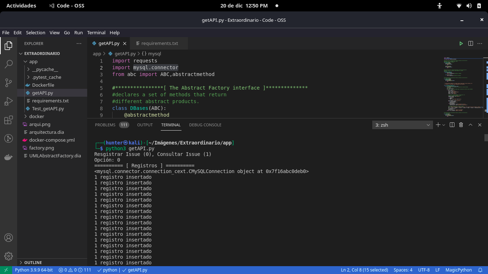
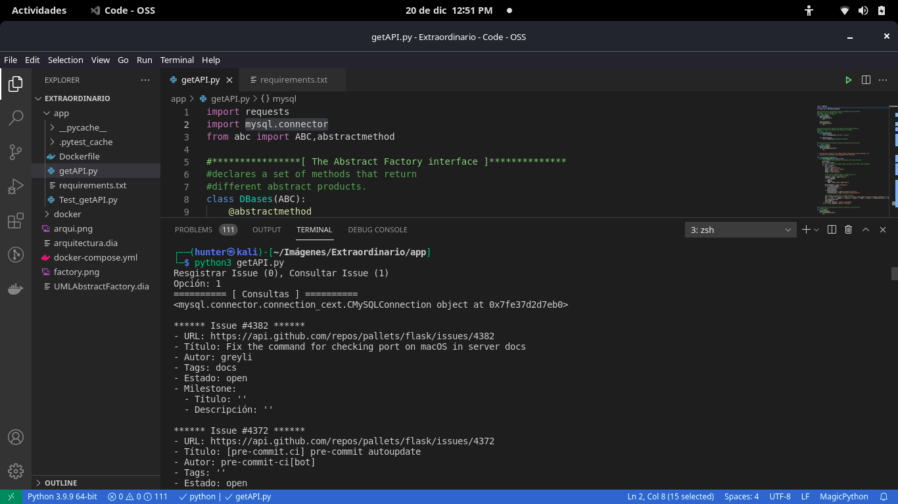
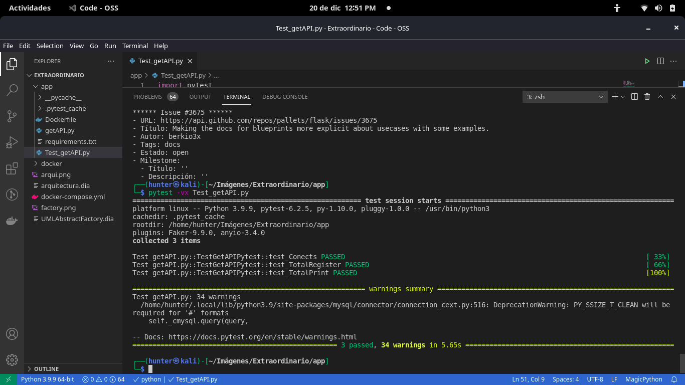
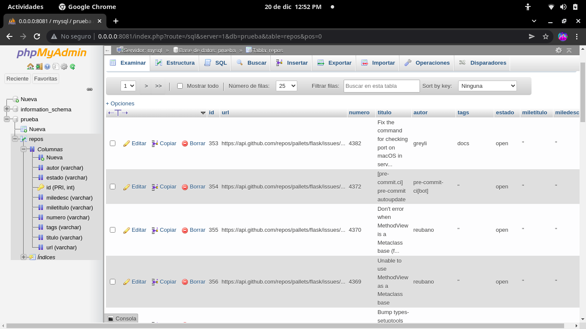
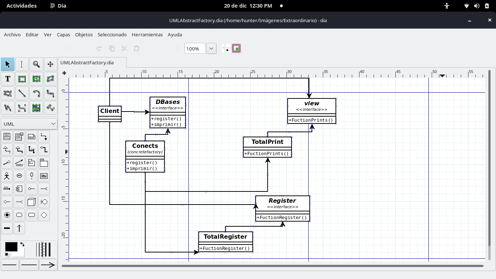
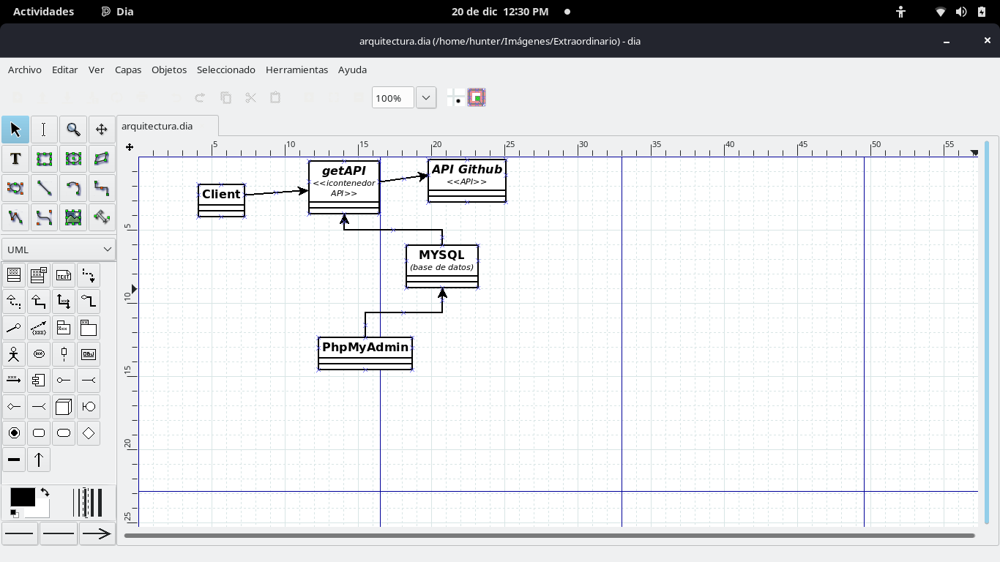

# SOLUCIÓN 
___
**API giyhub** 
>*El reto fue aprender a utilizar la API de [Github](https://docs.github.com/en/rest) leyendo su documentación en su paguina.*
___

**Desarrollando los scripts en python**
>*Antes de crear mis contenedores de docker con [xampp](https://www.apachefriends.org/es/index.html) creer un entorno rapido para poder crear mis scripts y probarlos si hay conexión con la base de datos MSQL mediante la libreria "mysql.connector".*

>*Una ves visto la conexión de la base de datos y recopilando los datos de la API comenzamos a llenar la base de datos y realizar las consulas incluyendo los test unitarios "Pruebas unitarias" con la libreria "pytest".*
___
**DOCKER**
>*Comenzamos a crear nuestro docker file con el cual lo configuramos por así decirlo para crear y copiar la raiz de un directorio de trabajo y que instalara los requerimientos que necesitamos para los scripts de python.*

>*Unas ves terminado el docker file se comienza a trabajar con docker-compose.yml para crear nuestros contenedores de los cuales el contenedor msql1("contiene la base de datos"), el contenedor phpmyadmin("contiene el administrador de la base de datos") y por ultimo el contenedor getdata("contiene nuestro dockerfile para su construcción").*
___
**CREACIÓN DE LOS DIAGRAMAS**
>*Para crear los diagramas yo utilice el programa dia, cree un diagrama para el patron de diseño abstract factory y otro para la arquitectura del proyecto*
___
**IMAGENES**

