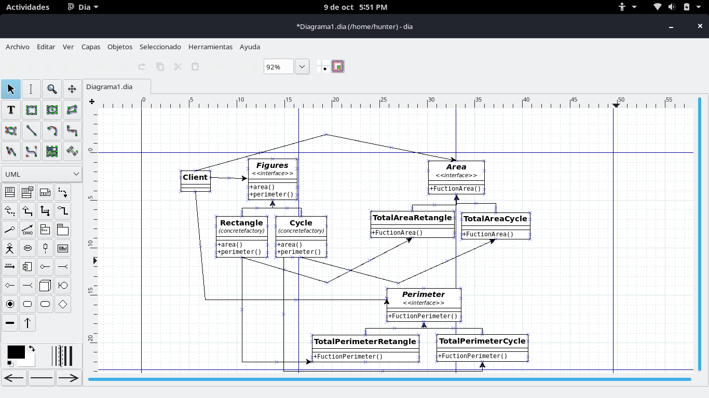

# Abstract Factory

**Abstract Factory** es un patrón de diseño creativo, que resuelve el problema de crear líneas de productos enteras sin especificar sus clases específicas.

La estructura es la siguiente:

- **Cliente:** Cliente lo que quiere es obtener una instancia de alguno de los productos (ProductoA, ProductoB).
- **AbstractFactory:** Es la definición de la interfaces de las factorías. Debe de proveer un método para la obtención de cada objeto que pueda crear. "crearProductoA()" y "crearProductoB()".
- **Factorías Concretas:** Estas son las diferentes familias de productos. Provee de la instancia concreta de la que se encarga de crear.
- **Producto abstracto:** Definición de las interfaces para la familia de productos, "ProductoA" y "ProductoB".
- **Producto concreto:** Implementación de los diferentes productos. 
___

## Problema ##

Implementar una simulación de un sistema para calcular el área y perímetro de las figuras en este caso siendo rectángulo y circulo.
Por el cual debemos de implementar un patrón de diseño **Abstract Factory**.

## Solución ##

Implementando pytest como se vio en clase y así poner en practica el testing, nos basamos en la metodología de [Red-Green-Refactor](https://www.codecademy.com/articles/tdd-red-green-refactor) y estudiando el patrón de diseño que nos tocó en este caso **Abstract Factory**
en la siguiente pagina [Refactoring Guru](https://refactoring.guru/es/design-patterns/abstract-factory), en base a lo estudiado y comprendido de que trata este patrón de diseño pudimos resolver el problema de las figuras.
___

___
## Recursos de estudio ##
Los recursos se estudiaron de la pagina recomendada [Refactoring Guru](https://refactoring.guru/es/design-patterns/abstract-factory)
y lo que se vio en clase MS Teams
