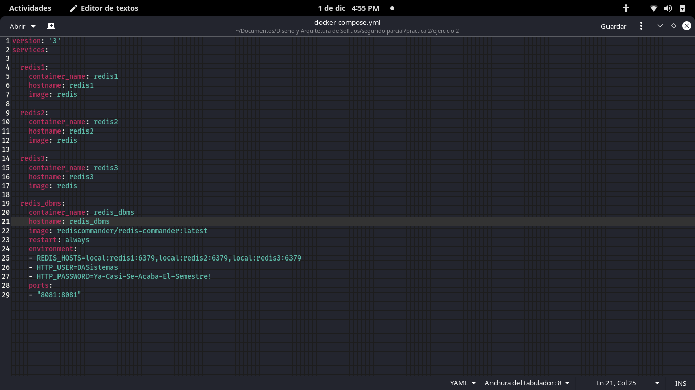
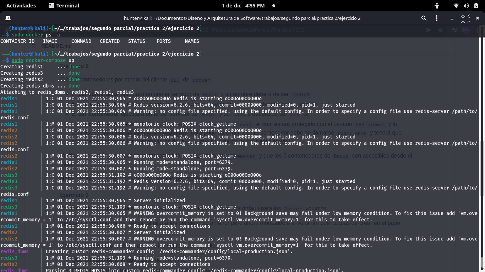
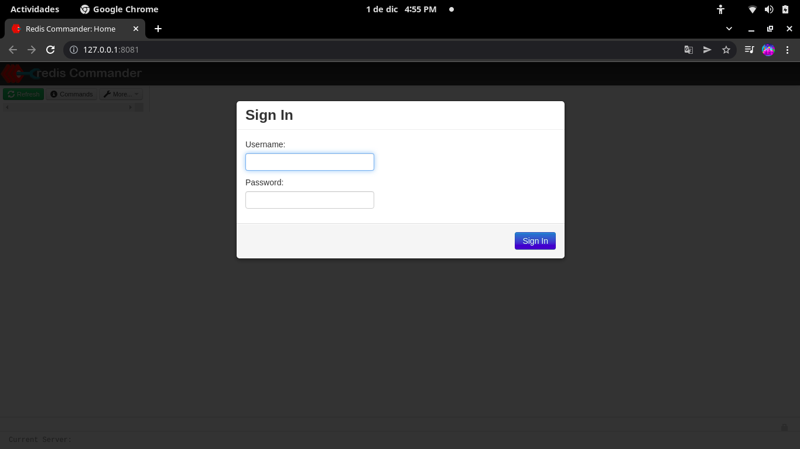
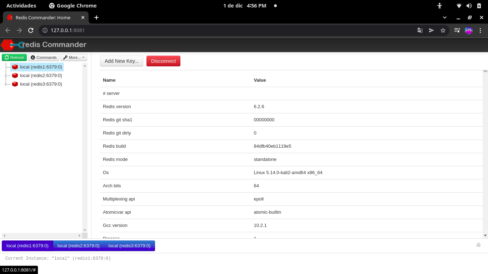

# Ejercicio 2
>*Crea 4 contenedores por medio del cliente CLI de docker:*

- **El 1er contenedor ejecutará un primer servidor de Redis y su nombre deberá de ser redis1**
- **El 2do contenedor ejecutará un segundo servidor de Redis y su nombre deberá de ser redis2**
- **El 3er contenedor ejecutará un tercer servidor de Redis y su nombre deberá de ser redis3**
- **El 4to contenedor deberá de ejecutar un servidor de Redis Commander el cual estará protegido con el usuario DASistemas y la contraseña Ya-Casi-Se-Acaba-El-Semestre! para poder acceder a él. El contenedor debe de llamarse redis_dbms y tendrá que conectarse con todos los contenedores de Redis que se crearon en los pasos previos**
___
## Solución ##
>*Creamos nuestro archivo .yml y modificamos el archivo para utilizar docker-compose*

>version: '3'
services:
  redis1:
    container_name: redis1
    hostname: redis1
    image: redis
  redis2:
    container_name: redis2
    hostname: redis2
    image: redis
  redis3:
    container_name: redis3
    hostname: redis3
    image: redis
  redis_dbms:
    container_name: redis_dbms
    hostname: redis_dbms
    image: rediscommander/redis-commander:latest
    restart: always
    environment:
    - REDIS_HOSTS=local:redis1:6379,local:redis2:6379,local:redis3:6379
    - HTTP_USER=DASistemas
    - HTTP_PASSWORD=Ya-Casi-Se-Acaba-El-Semestre!
    ports:
    - "8081:8081"

>*Unas ves teniendo nuestro archivo .yml ejecutamos el siguiente comando*

- **$ sudo docker-compose up**
___
## Imagenes del Ejercicio 2 ##

