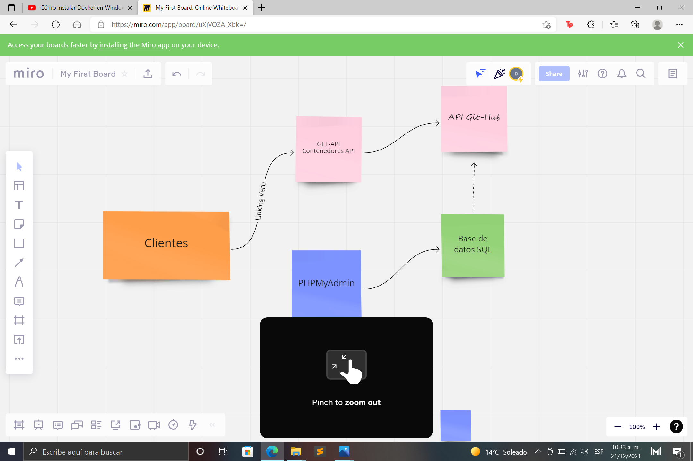
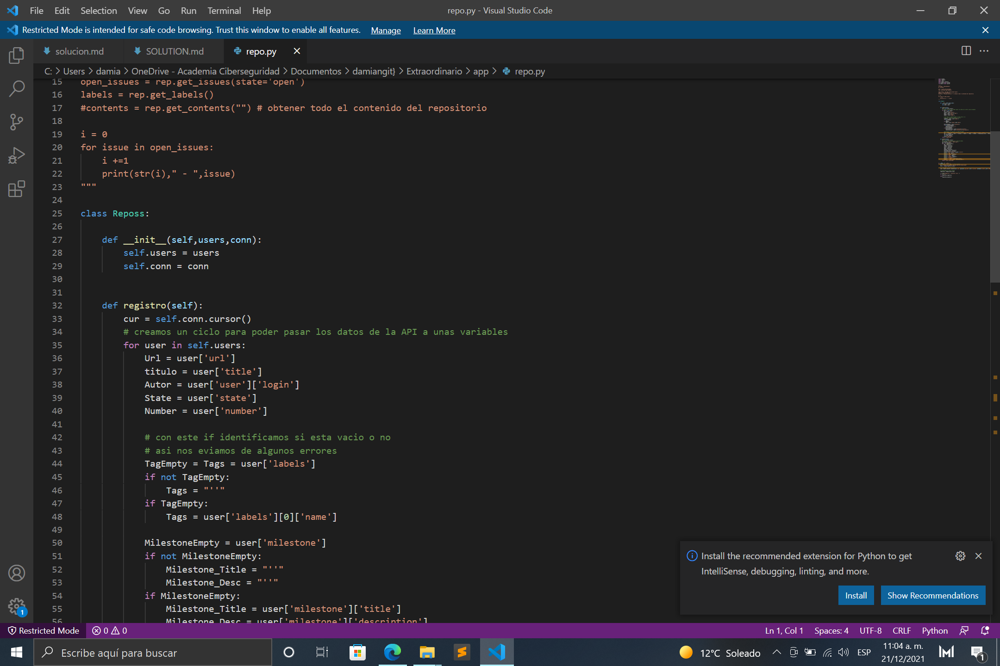
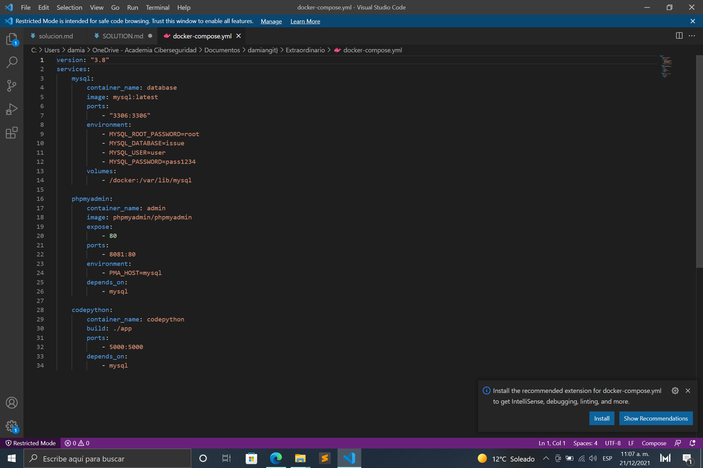
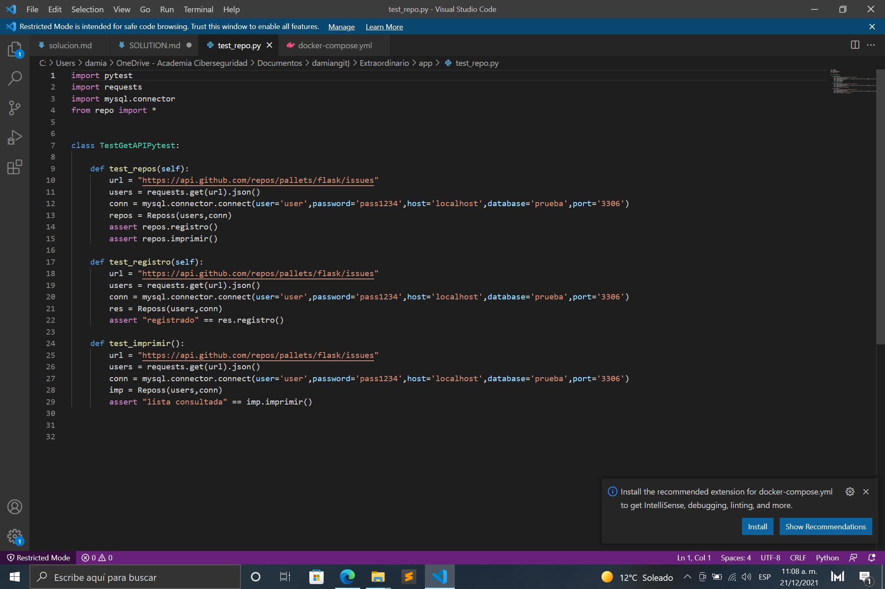
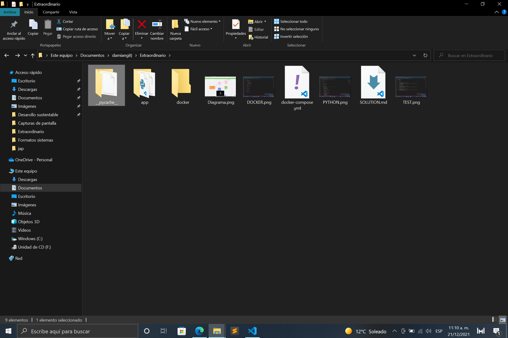

# EXTRAORDINARIO SOLUCION

**Alumno Damian Rafael Hernandez Saucedo**
**Matricula 05340275**
**Ing. SISTEMAS COMPUTACIONALES**
_____
**Especificaciones**
Este ejercicio va a consistir en conectarnos con la API de GitHub.

Queremos descargar y almacenar en una base de datos todos los issues del repositorio de https://github.com/pallets/flask que contengan la etiqueta/label de bug. Los campos que nos interesan son los siguientes:

- URL real del issue (la que se puede visitar desde GitHub)
- Titulo del issue
- Numero del issue
- Nombre del autor del issue
- Lista de todas las tags para ese issue ('bug' debe de estar entre esas etiquetas, pero puede haber más etiquetas como la etiqueta 'docs' por ejemplo)
- Estado del issue
- Titulo del milestone al que pertenece
- Descripcion del milestone al que pertenece

Finalmente debemos de ejecutar una lectura a la base de datos con la cual obtengamos todos los issues desde la base de datos y los imprimamos uno por uno a terminal con el siguiente formato:

****** Issue #1902 ******
- URL: <https://github.com/pallets/flask/issues/1902>
- Título: 'Import error with some examples'
- Autor: 'rnelsonchem'
- Tags: ['bug', 'cli', 'docs']
- Estado: 'closed'
- Milestone
  - Título: '1.0'
  - Descripción: ''

  Daremos paso a la solucion del problema

  _____
  **Api Git**
  - lo primero fue aprender a utilizar y manejar la API de git para esto nos apoyamos en videos y tutoriales que pondremos al final como referencias tam,bien consultamos foros de discucion.
  - API  [Github](https://docs.github.com/en/rest) aqui veremos su documentacion.
  _____
  **Desarrollo**
  - Antes que nada crearemos los contenedores en docker para esto lo convinaremos o nos apoyaremos con con [xampp](https://www.apachefriends.org/es/index.html)
  para la gestion del problema y probamos si hay conexion y verificaremos que no se encuentre ningun error.

  - ya probando la conexion ahora si viene lo bueno hay que recopilar los datos o extraer de la API y recordar verificar como consultando los datos realizando pruebas.
  ____
  **DOCKER O DOCKERISACION**
  - Primer tendremos que crear nuestro docker trabajar con el configurarlo asi podremos crear unn copia en la raiz de trabajo y recordar istalar los requerimientos necesarios para el desarrollo.

  - ya que terminamos lo anterior ahora trabajaremos con docker-compose.yml para los contenedores, aqui en lo personal el reto fue familiarisarse muy bien con docker ya que es muy complejo pero muy util por lo que se vio durante la materia la recomendacion personal seguir practicando y jugando con docker.
  _____
  para la creacion del diagrama nos apoyamos en una pagina online y claro tambien viendo ejemplos anteriores en la clase. https://miro.com/es/diagramas-online/
  
  
  
  
  

