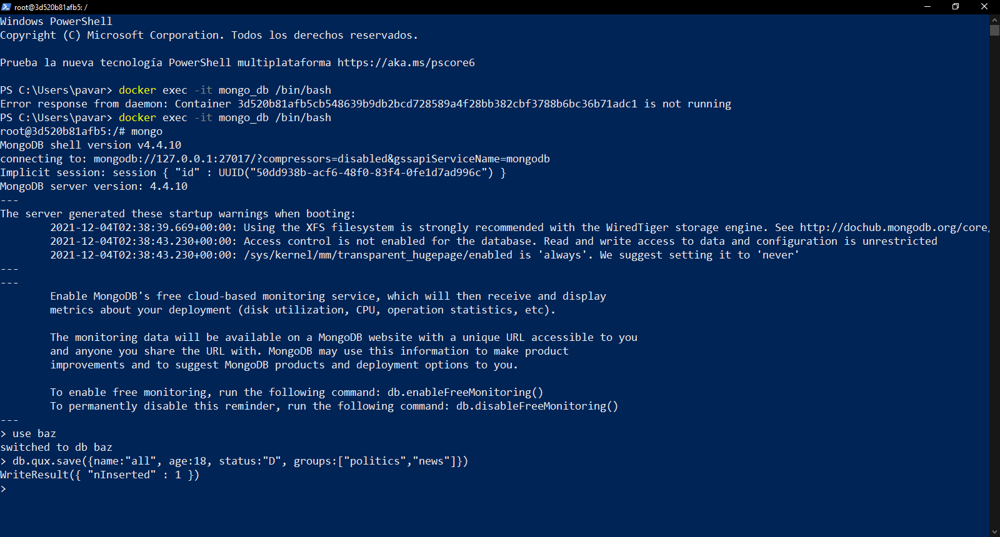
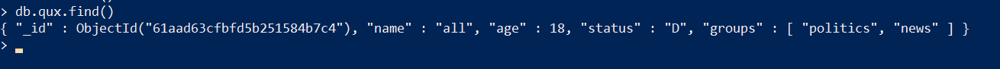
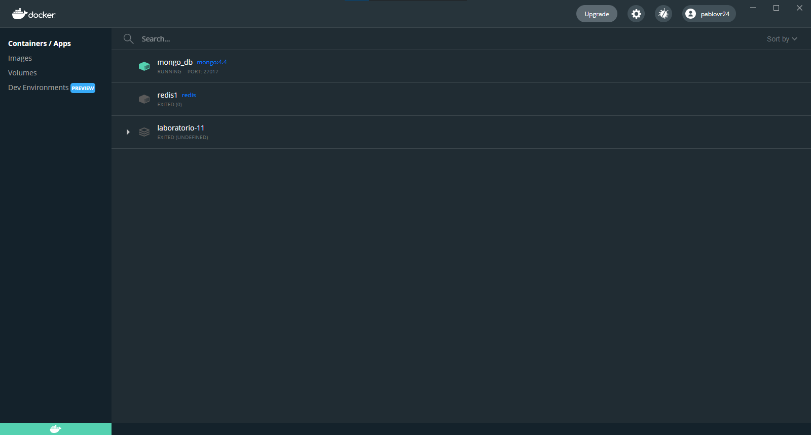

# Practica 2 - Parcial 2

## Ejercicio 1

- Crear un contenedor que se llame "mongo_db"

- Que corra en los puertos 27017

- Con nombre de usuario "foo"

- Con contraseña bar123

- En la version 4.4 de mongo

```
docker run -p 27017:27017
-e MONGODB_ROOT_USERNAME=foo
-e MONGODB_ROOT_PASSWORD=bar123
--name mongo_db
-d mongo:4.4
```

Para acceder al contenedor

```
docker exec -it mongo_db /bin/bash
```
**¿Con qué comando(s) puedo conectarme a la base de datos de MongoDB corriendo dentro de mi contenedor de mongo_db?**
```
use baz
```

**¿Cómo puedo insertar este registro en la colección de qux creada previamente?**
```
db.qux.save({name: "all", age:18, status:"D", groups:["politics", "news"]})
```

## Screenshots




