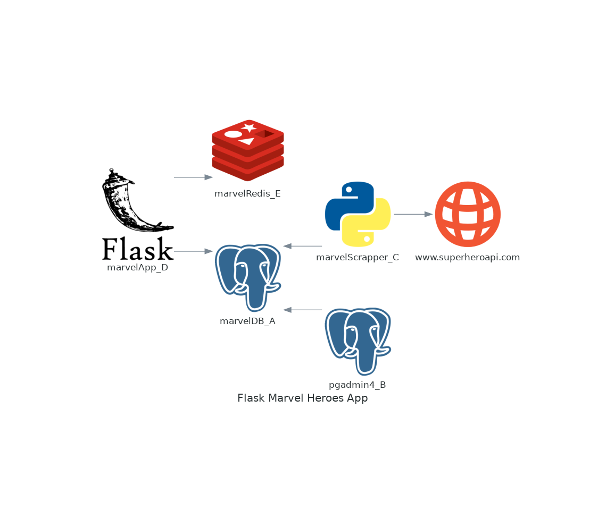
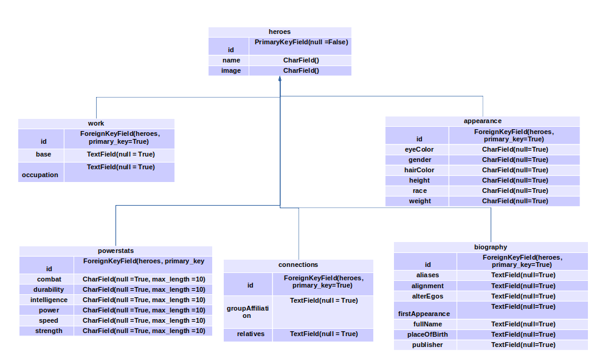

# Marvel Heroes

## Descripcion

Contenedores en docker que consumen y ofrecen servicios

## Descripcion de los contenedores

### marvelDB_A: 
    Base de datos postgres, nombre de usuario: postgres, password: marvel123, db: 
    psql_db = PostgresqlDatabase('marvelHeroes', user='postgres', host='marvelDB_A', password='marvel123')

### pgadmin4_B:
    PGADMIN_DEFAULT_EMAIL: "marvel@marvel.com"
    PGADMIN_DEFAULT_PASSWORD: "marvel123"
    PORTS: - "80:80"

### marvelScrapper_C:
    Scrapper en python que llena la base de datos postgres con la informacion de los heroes de marvel que consume del
    API https://superheroapi.com/ 

### marvelApp_D:
    App en Flask que presenta la informacion almacenada en nuestra base de datos al usuario y utiliza el sistema
    de templates jinja.
    localhost:5000

### marvelRedis_E:
    Sistema de cache redis para consultas select a la base de datos y optimizar los tiempos como evitando joins.
    ports: 6379:6379

## Rutas en la aplicacion

'/': Index de la app, lista de indices y heroes de marvel
 
'/hero/{id heroe}': Muestra una pagina con informacion detallada del heroe

'/test': Ejecuta pruebas entre consultas a la base de datos postgres y la de redis

## Estructura de directorios
.
├── app

│   ├── appMarvel.py

│   ├── Dockerfile

│   ├── marvelAPI.py

│   ├── modelsMarvel.py

│   ├── querys.py

│   ├── redMarvQuerys.py

│   ├── requirements.txt

│   ├── scrapper.py

│   ├── static

│   │   └── images

│   │       └── notFound.jpg

│   └── templates

│       ├── hero.html

│       ├── heroNotFound.html

│       ├── indexBase.html

│       ├── index.html

│       └── test.html

├── config

│   └── redis.conf

├── data [error opening dir]

├── docker-compose.yml

└── readme.md

## Instrucciones

en la carpeta del proyecto ejecutar el comando:
    docker-compose up

asegurarse el directorio data/ este vacio, si hay algun archivo eliminelo, de tal manera que quede el 
directorio vacio,servira como volumen para la base de datos postgres.

esperar a que se inicien los contenedores y los scripts finalizen, entonces podras ver desde el navegador
con el siguiente enlance: localhost:5000 la aplicacion, desplazate atraves de ella desde la lista o desde
la url localhost:5000/hero/[id-hero] donde [id-hero] es un numero entero entre 1 y 732 que corresponda al 
id del heroe, los id siguen correspondiendo al indice original de la base de datos del api de supherheroes
por lo que hay consultas a ids que devuelven un mensaje de que el heroe no se ha encontrado. Tambien en
localhost:5000/test encontraras una comparativa entre los tiempos de consulta a redis y postgres.

En el supuesto que el contenedor redis no llegara a arrancar se deberan cambiar los puertos ya que eso nos 
ocasiono algunos problemas 
    ports 6380:6379 --- > docker-compose.yml

## Link Repositorio del Proyecto
* **Ordinario** - ** - [Proyecto-Marvel](https://github.com/deorelaLara/Docker/tree/master/marvelHeroes-master)

## Pruebas

ID TO TEST: 732 

RANGE TO TEST: 0-735

| 	      Prueba              |   SIN REDIS 	      |    CON REDIS          |
|-----------------------------|-----------------------|-----------------------|
| TEST EXIST ID 	          | 0.006963968276977539  |	0.00035953521728515625|
| TEST GET HEROES IDS NAMES   |	0.010428667068481445  |	0.00020456314086914062|
| TEST GET HERO 	          | 0.009013652801513672  |	0.00018215179443359375|
| TEST GET ALL FROM HEROES 	  | 3.9903736114501953 	  | 0.11438941955566406   |

