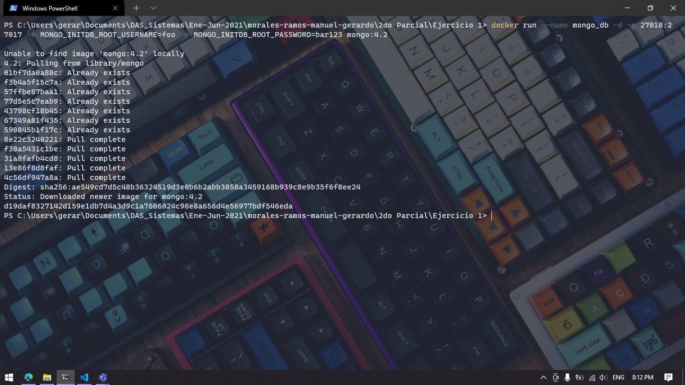
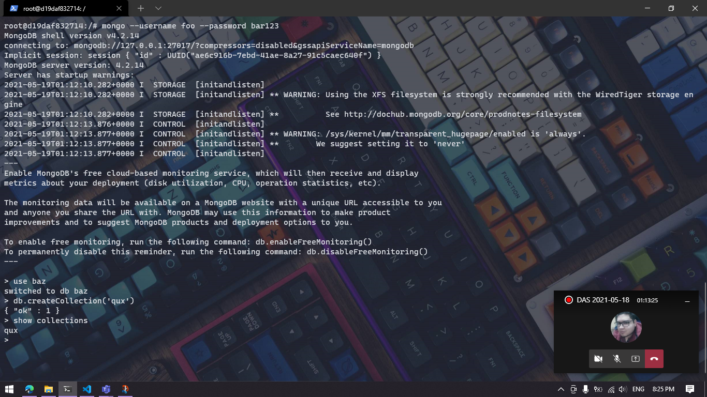
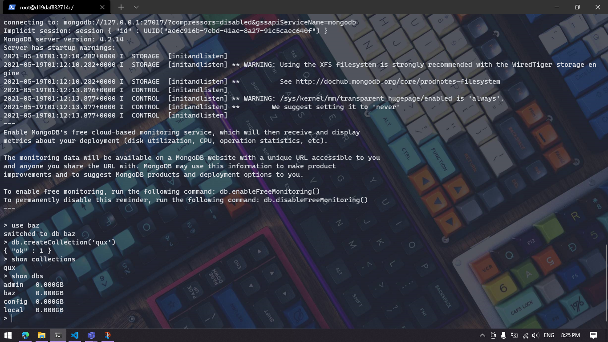

# Ejercicio 1

El comando necesario para levantar un contenedor de Docker corriendo un servidor de MongoDB cumpliendo los puntos dados es:

`docker run --name mongo_db -d -p 27018:27017 -e MONGO_INITDB_ROOT_USERNAME=foo -e MONGO_INITDB_ROOT_PASSWORD=bar123 mongo:4.2`

*P.D. El puerto sería 27017:27017 pero tengo corriendo MongoDB en local, entonces, para practicidad puse el 27018*

---

El comando para entrar a la base de datos con permisos sería:

* Primero entro al contenedor de Mongo mediante:
    * `docker exec -it mongo_db bash`
* Después, ejecuto MongoDB escribiendo:
    * `mongo --username foo --password bar123`

---

Lo siguiente es crear la base de datos y la colección de la siguiente manera: 

1. `use baz`
2. `db.createCollection('qux')`

---

Para insertar un documento utilicé:

`db.qux.insertOne( { "title": "Title", "image": "image.png", "abstract": "lorem ipsum" } )`

