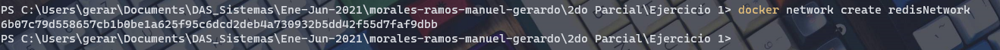
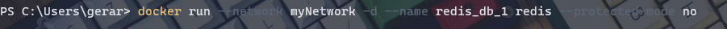
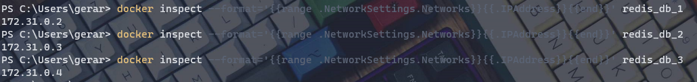
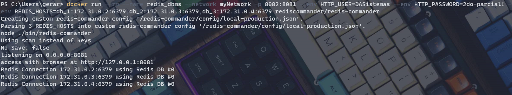
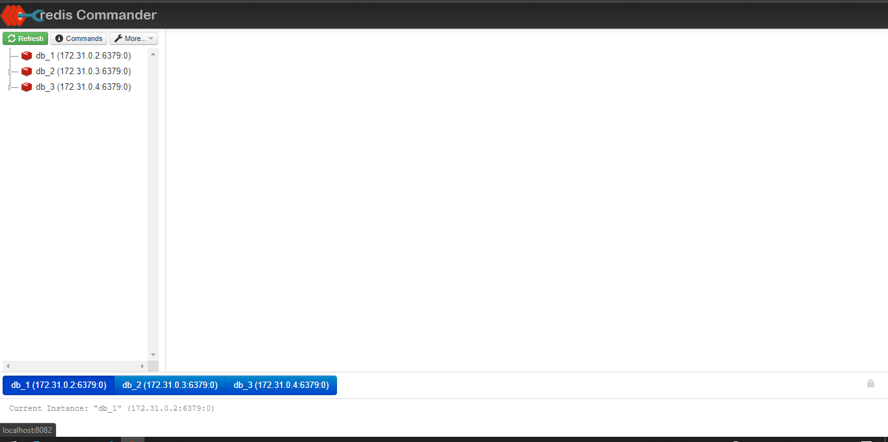

# Ejercicio 2

Primero que nada creo una network con

`docker network create <network-name>`

*La red cambia porque tuve algunos problemas y olvidé que ya había creado una red he hice otra*

---

Creando contenedores de redis

`docker run -d --network=myNetwork --name redis_db_n redis --protected-mode no`

---

Antes de correr el contenedor del DBMS utilicé otro comando porque tuve problemas al hacer el "matching" o mapear las direcciones IP de los contenedores. Lo que hice fue ejecutar lo siguiente:

`docker inspect --format='{{range .NetworkSettings.Networks}}{{.Port}}{{end}}' redis_db_1`

Con esto obtenía la dirección IP de los contenedores de redis.

[Aquí es donde encontré la ayuda](https://github.com/docker-library/redis/issues/45)

---

Ahora sí creo el contenedor del DBMS con

`docker run --rm --name redis_dbms --network myNetwork -p 8082:8081 --env HTTP_USER=DASistemas --env HTTP_PASSWORD=2do-parcial! --env REDIS_HOSTS=db_1:172.31.0.2:6379,db_2:172.31.0.3:6379,db_3:172.31.0.4:6379 rediscommander/redis-commander`

*Entro con el navegador a 0.0.0.0:8082, no con la url que menciona redis commander*

---

Listo. A insertar las credenciales y ver los tres contenedores. :)

