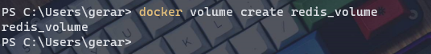
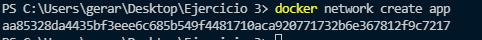
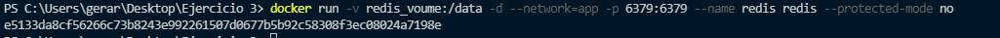
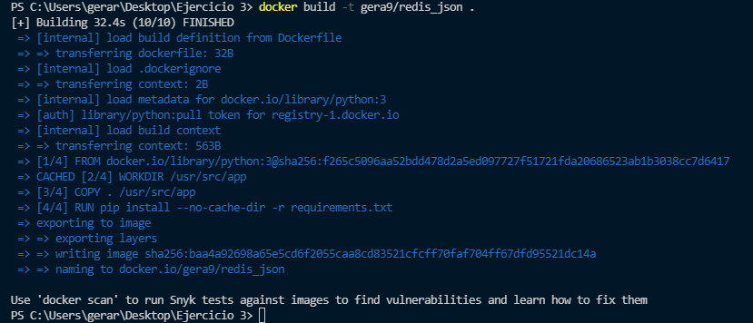
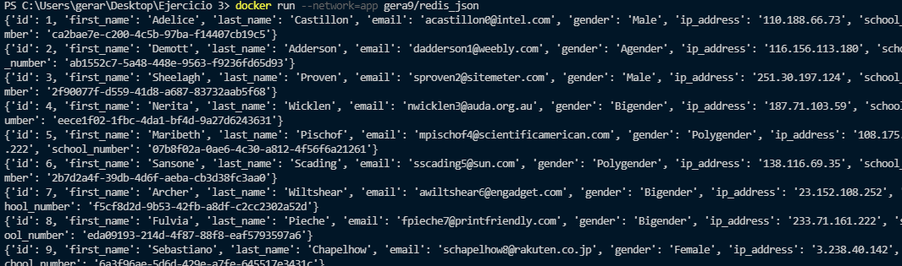
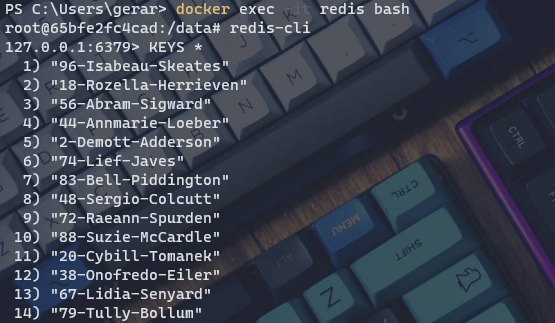
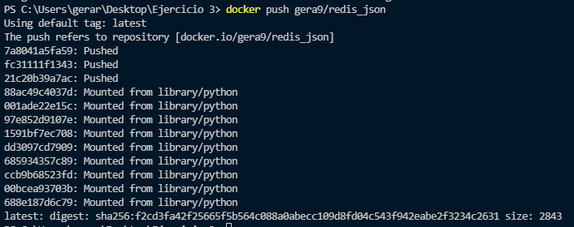

# Ejercicio 3

Creo el volumen con `docker volume create <volume name>`:

---

Creo una network para conectar los contenedores con

`docker network create app`

---

Corro y creo el contenedor de redis con datos persistentes y la red anteriormente con

`docker run -v redis_voume:/data -d --network=app -p 6379:6379 --name redis redis --protected-mode no`

---

Creando la imagen gera9/redis_json con

`docker build -t gera9/redis_json .`

---

Corro el contenedor de Python con

`docker run --network=app gera9/redis_json`

*También se puede observar que se han insertado correctamente los datos en la imagen.*

---

Ahora miramos el contenedor de redis y checamos si están los datos insertados con

`docker exec -it <container-name> bash`

Después

`redis-cli`

Y obtenemos --por ejemplo-- las keys con

`KEYS *`

---

Por último subo la imagen con

`docker push gera9/redis_json`

La imagen está [aquí](https://hub.docker.com/repository/docker/gera9/redis_json). También se puede descargar desde Docker con

`docker push gera9/redis_json`
