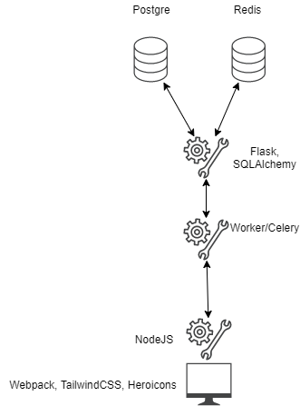

# Ejercicio 4

---

Tratando de entender el código pude llegar a este diagrama. No estoy muy seguro pero en base a pequeños proyectos que he hecho, las colas de tareas se usan normalmente para intercambiar mensajes entre contenedores capaces de procesar información. En este caso encontré la aplicación de flask en base a Python y la aplicación del lado del forntend en base a NodeJS.

Las bases de datos están en su propio contenedor. Estas se conectan a la aplicación de flask como normalmente se hace.

