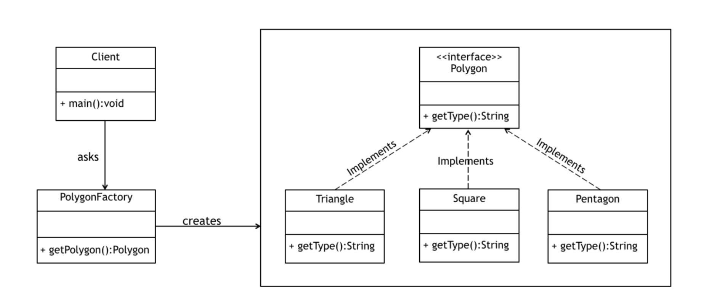

# 1er. Examen Parcial

## Previo

* Desarrolla los ejemplos de código en tu computadora y envíalos al repositorio de la materia siguiendo los [lineamientos de contribución del repositorio](https://github.com/AnhellO/DAS_Sistemas#contributing). La carpeta del examen en este caso tendrá que llamarse `../Primer Parcial/..`
* Cada ejercicio deberá estar en una carpeta por separado, es decir `../Primer Parcial/Ejercicio 1/..`
* Las pruebas de tus ejercicios (es decir, los objetos que instancies y las pruebas que hagas) deberán de estar dentro de la función `main` para cada ejercicio
* No es necesario leer un input/entrada desde la consola (terminal), pero puedes hacerlo si así gustas
* **NO** envíes tu pull request ni hagas commit de tu código hasta la hora límite (`Sábado 19 de Marzo del 2022 a las 11:59pm`) para evitar que este sea copiado :wink:
* Explica la lógica utilizada detrás de cada uno de los ejercicios. Pueden ser como un archivo de texto por separado, o bien, como comentarios dentro del mismo código

## Especificaciones y Requerimientos

### Ejercicios

#### Ejercicio 1

Crea una clase `Page` que represente a una página dentro de un sitio web. La clase deberá de contener múltiples atributos que pertenezcan a una página web (al menos 10 diferentes), por ejemplo url, folder o path, links o hipervínculos, contenido de texto, título (`<h1>`), etiqueta de título (`<title>`), meta-descripción, formato (`HTML`, `XML`, `JSON`, etc), etcétera (Recurso: <https://es.wikipedia.org/wiki/P%C3%A1gina_web>)

Crea una 2da clase `Website` que represente a un sitio web como un todo/conjunto. La clase deberá de contener múltiples atributos que describan a un sitio web (al menos 7), por ejemplo dominio, subdominio, páginas que forman parte del sitio, entre otros (Recurso: <https://mx.godaddy.com/blog/que-es-un-sitio-web/>)

* La clase `Website` deberá contener como uno de sus atributos a la colección de páginas de forman parte del sitio. Los objetos de esta colección deberán de ser del tipo `Page` previamente creado
* Implementa una función `buscador`, que reciba dos parámetros, uno de tipo `Website`, y el otro de tipo `Page`. La función deberá de llevar a cabo una búsqueda dentro del conjunto de páginas del sitio para determinar si es que la página existe

#### Ejercicio 2

**Builder Pattern:** <https://refactoring.guru/es/design-patterns/builder>

Implementa el patrón de diseño `Builder` de tal manera que podamos construir objetos de tipo `Page` y de tipo `Website` siguiendo el esquema propuesto por el patrón. Como en este caso queremos construir dos diferentes tipos de objetos entonces vamos a necesitar un mayor nivel de abstracción a través de la interfaz `Builder`.

Asegúrate de implementar la clase `Director` también, de tal manera que podamos tener diferentes configuraciones de creación de instancias para cada una de las clases del ejercicio 1.

#### Ejercicio 3

**Factory Method Pattern:** <https://refactoring.guru/es/design-patterns/factory-method>.

Implementa el patrón de diseño `Factory Method` para el siguiente diagrama UML:

Para este caso en concreto asegúrate de seguir la filosofía T.D.D. con su mantra Red-Green-Refactor para generar los respectivos test unitarios y la solución del ejercicio.

#### Ejercicio 4

**Visitor Pattern:** <https://refactoring.guru/es/design-patterns/visitor>.

Partiendo la suite de tests unitarios previamente creada en el archivo [`visitor_test.py`](visitor_test.py) y del diagrama propuesto en la sección de "_Pseudocódigo_" de la página de `Visitor` en Refactoring Guru:

* Queremos añadir soporte de exportación `XML`, `JSON` y `YAML` a la jerarquía de clases de formas geométricas propuestas
* Crea un nuevo archivo/módulo `visitor.py` que implemente el patrón de diseño `Visitor`
* Asegúrate de que todos los tests del archivo de pruebas unitarias pasan sin problema alguno al probar tu solución. La suite de pruebas unitarias **NO** debe de modificarse ni cambiarse en lo absoluto

#### Ejercicio 5

* Partiendo del ejemplo de código en el archivo [`ocp.py`](ocp.py) surgen la siguiente preguntas: ¿qué pasaría con esa escalera `if-elif` y en específico con la clase `Animal` si vamos agregando más especies de animales?
* Refactoriza el ejemplo proporcionado utilizando el principio `Open/Closed (OCP)` de tal forma que podamos agregar más funcionalidad de "animales" sin preocuparnos por la modificación de la clase `Animal`

### Puntos Extra

* Implementa la suite de tests unitarios para el **Ejercicio 1**
  * **(5 puntos sobre 100)**
* Implementa el patrón de diseño [`Proxy`](https://refactoring.guru/design-patterns/proxy) para agregar una capa de autenticación básica con `user` y `password` a los objetos de la clase `Website` del ejercicio 1
  * **(5 puntos sobre 100)**
* Implementa el patrón de diseño [`Composite`](https://refactoring.guru/design-patterns/composite) para estructurar la colección de objetos `Page` que forman parte del objeto `Website` en el ejercicio 1
  * **(5 puntos sobre 100)**
* Implementa el patrón de diseño [`Decorator`](https://refactoring.guru/design-patterns/decorator) sobre las clases y objetos del ejercicio 1 de tal manera que:
  * Decores objetos del tipo `Page` solamente si su formato es `HTML`. La idea es decorarlos agregando `CSS` sobre las etiquetas de `HTML` que forman parte del contenido de la página (Recurso: <https://www.w3.org/Style/Examples/011/firstcss.en.html>)
  * Ejemplo:
    * Contenido no decorado: `
Pellentesque habitant morbi tristique senectus et netus et malesuada fames ac turpis egestas.
`
    * Contenido decorado: `
Pellentesque habitant morbi tristique senectus et netus et malesuada fames ac turpis egestas.
`
  * Puedes implementar el patrón de diseño desde 0 con sus componentes/clases propias, o bien, utilizar los decoradores nativos de Python
* Generar los respectivos diagramas `UML` para cada una de las soluciones propuestas a los 5 ejercicios del examen
  * **(5 puntos sobre 100)**
