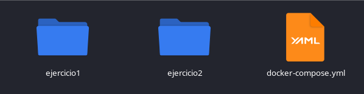
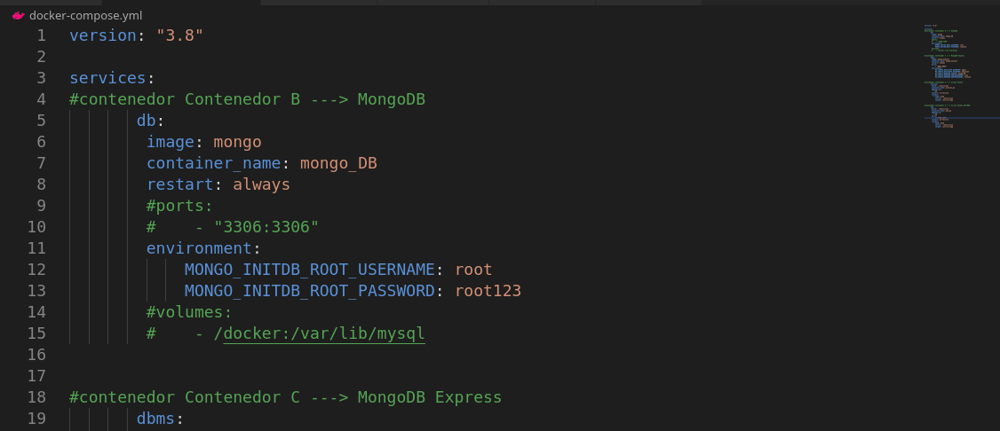
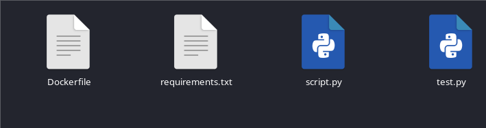
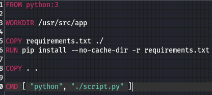
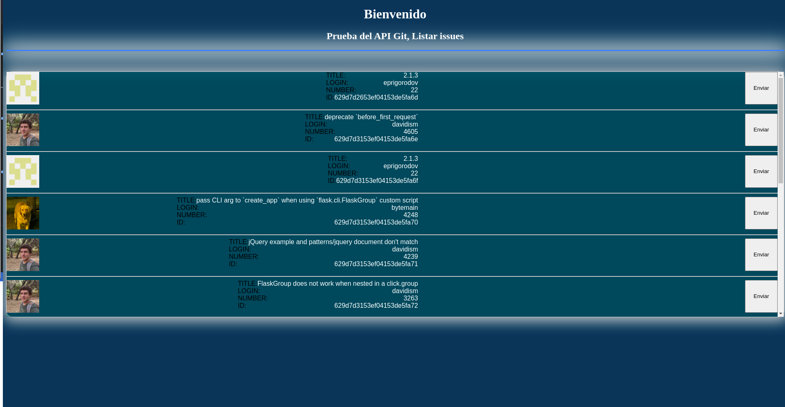
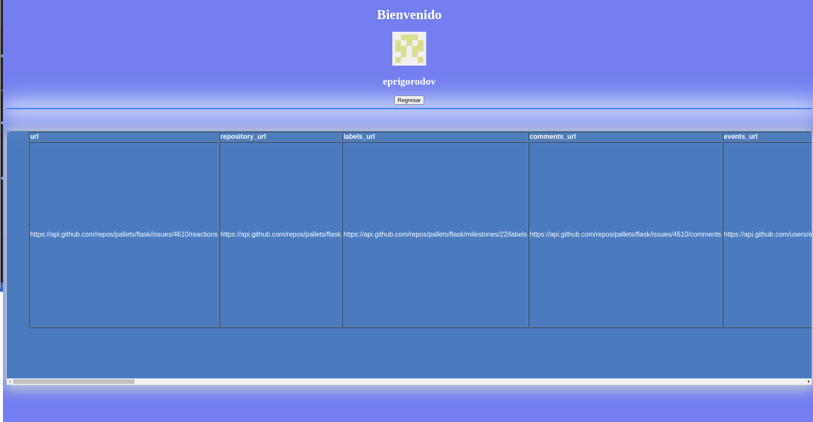

- **Creamos el docker-compose**

> código de docker-compose

- **Creamos el Dockerfile**

> codigo del Dockerfile en ambas partes de los scripts de python

- **Impresiones web**

> mostramos la incormación del issue

