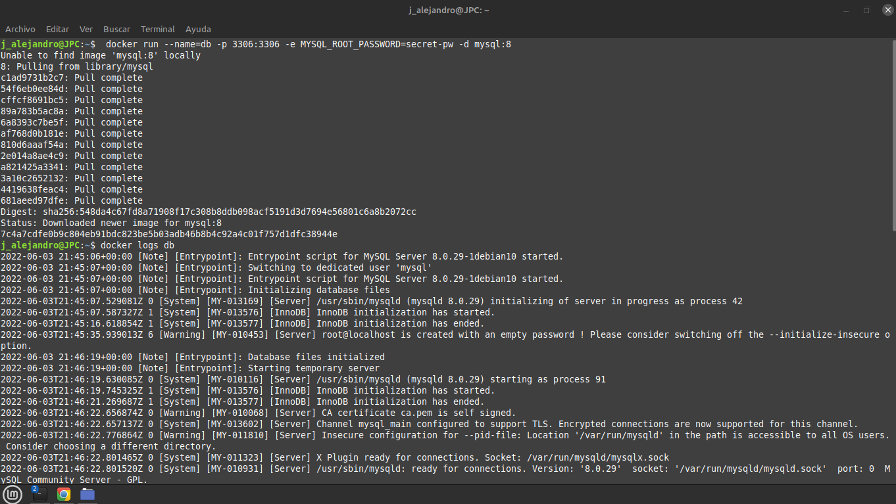
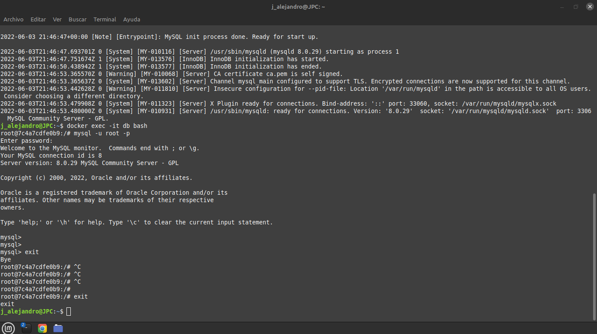
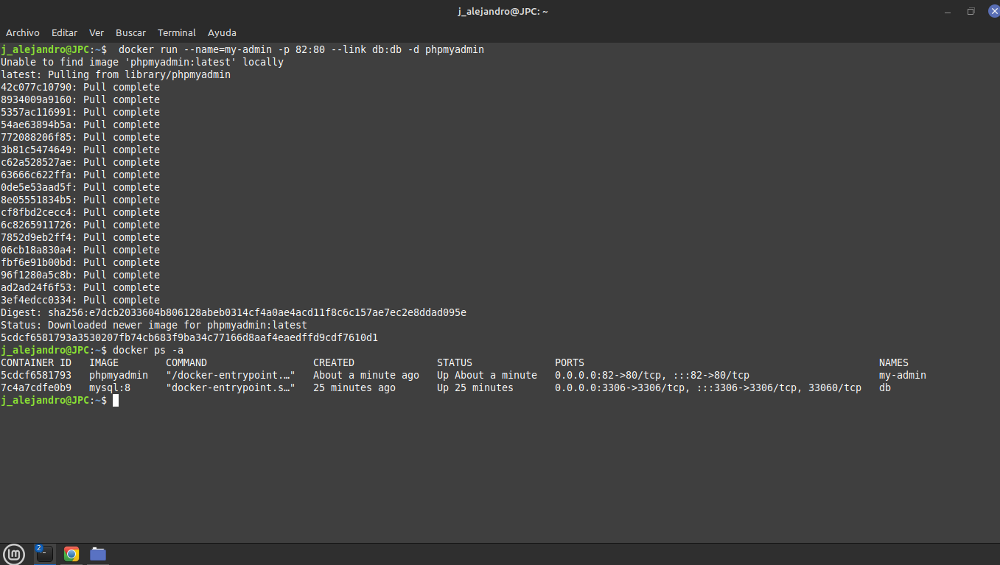
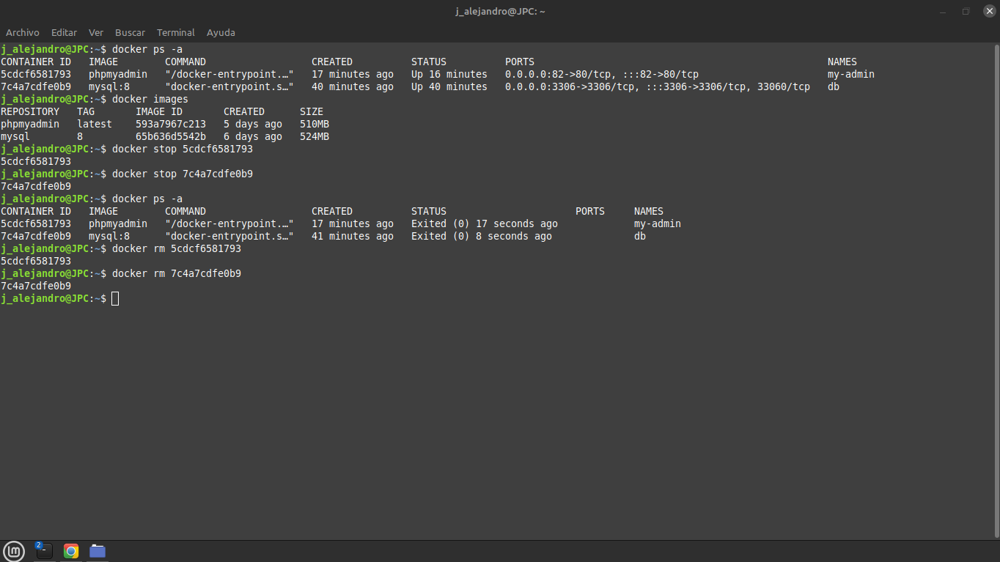

# Laboratorio 1

Se descargaron imagenes de Docker Hub con el comando docker run, se conecto con un  
contenedor dentro de la terminal. Borrar y tener contenedores con docker stop y rm.

No logre ingresar a phpMyAdmin con las credenciales, usuario : root y contraseña : secret-pw
___
## Screenshots
___

