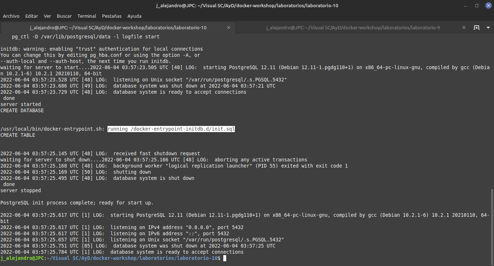
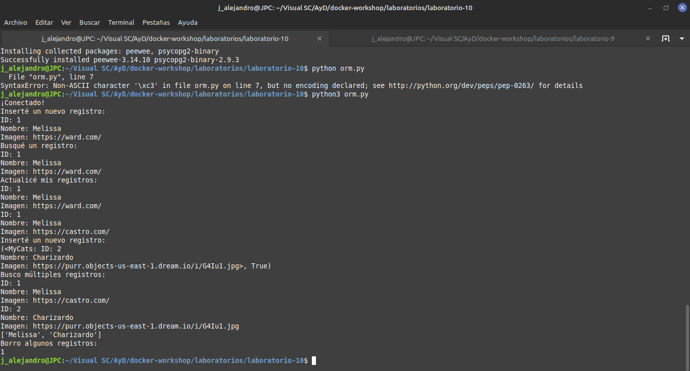
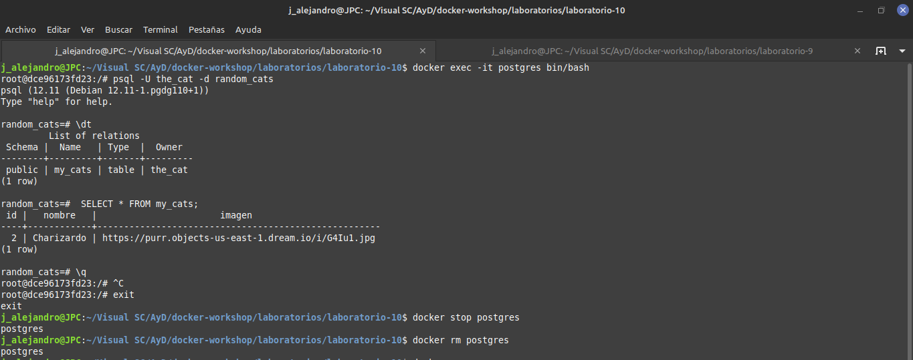

# Laboratorio 10
Operaciones CRUD por medio de un ORM con Peewee.

Contenedor de PostgreSQL.

Instalación de librerias con pip.

Ejecución de comandos dentro del contenedor.
___
## Screenshots
___

