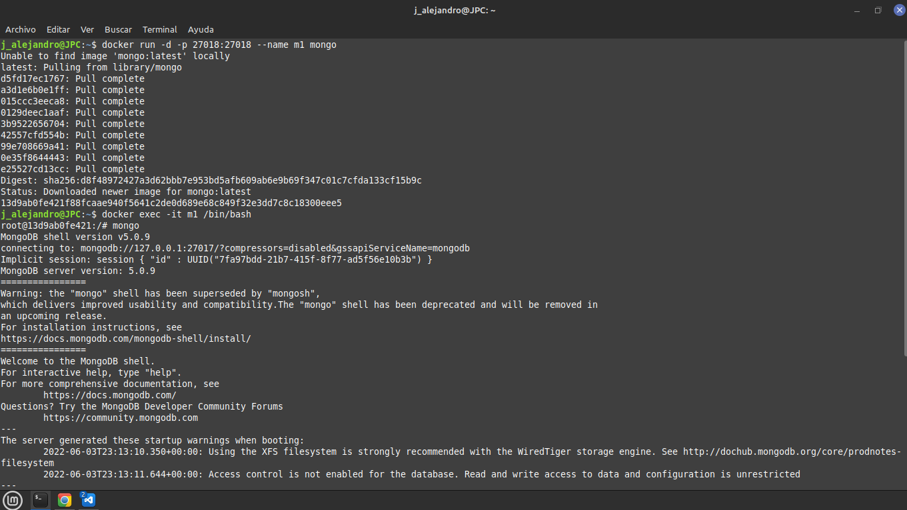
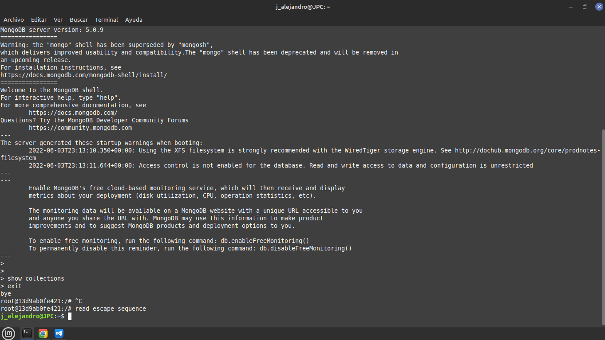

# Laboratorio 2
Uso de MongoDB a través de contenedores.

Uso de pip, para instalar la libreria de pymongo

Cambie el puerto, ya que me marcaba un error, "river failed programming external..."
___
## Screenshots
___

