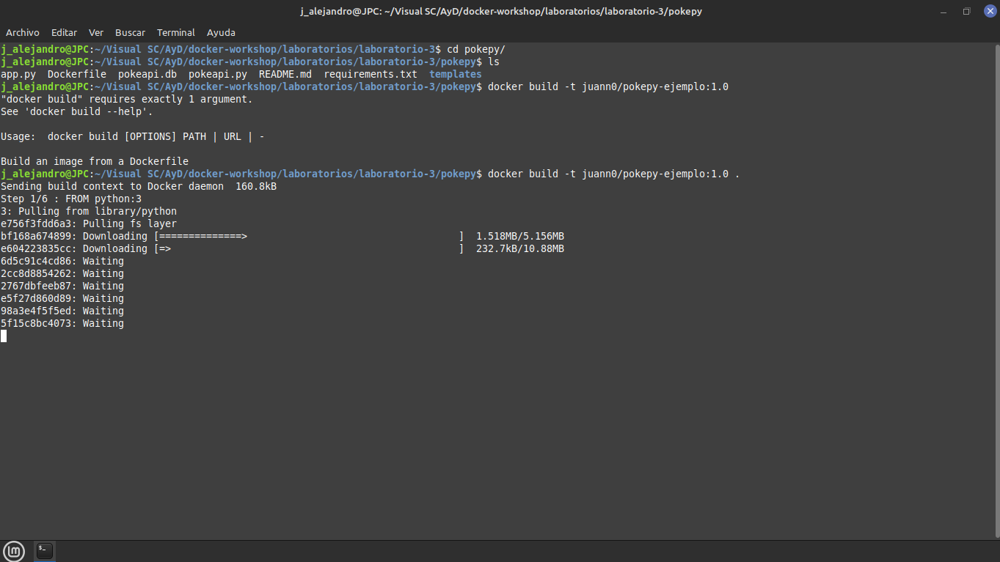
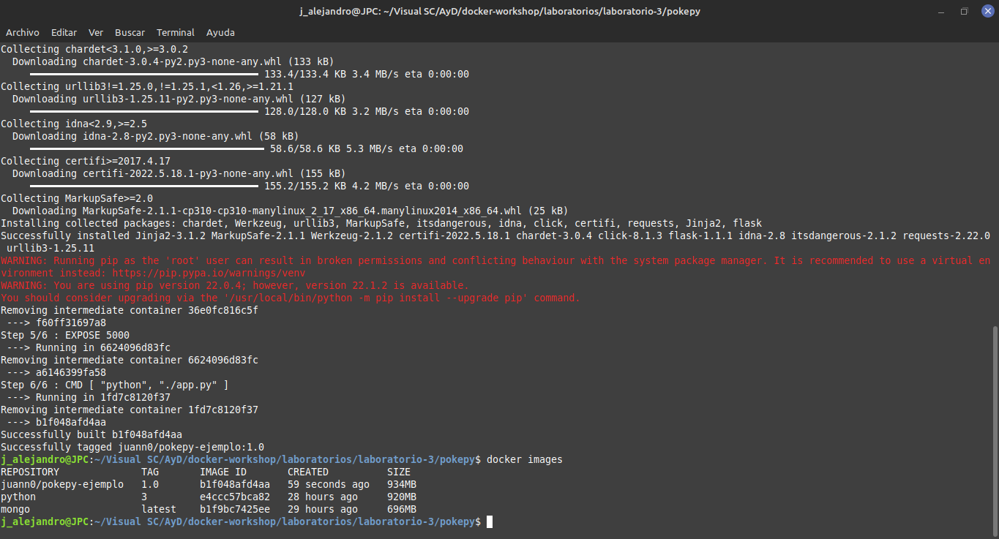
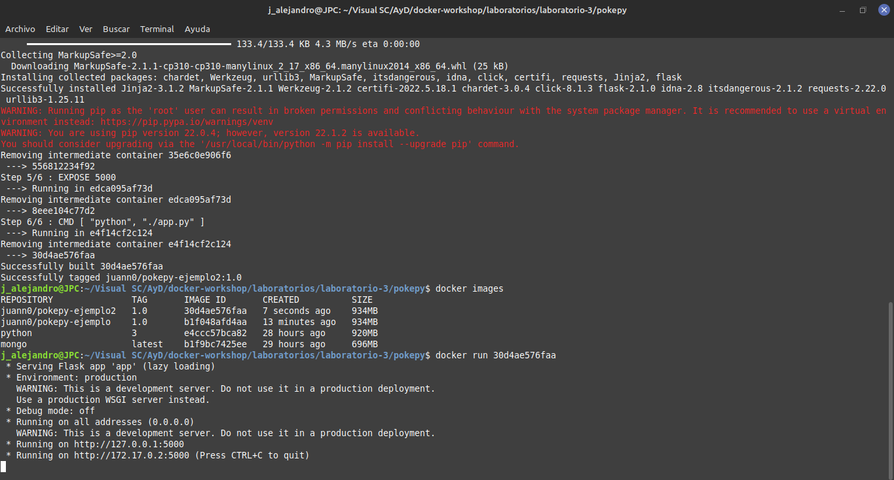
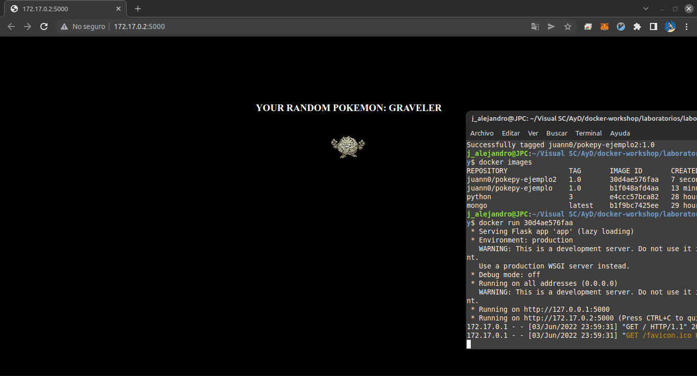

# Laboratorio 3
Uso de :
    
  - Clonar repo de GitHub
  - Cuenta de Docker Hub
  - Uso de API de Pokemon dentro del contenedor
  
- Obtuve el sig. error : ImportError: cannot import name 'escape' from 'jinja2' (/usr/local/lib/python3.10/site-packages/jinja2/__init__.py)

Investigue y resulto ser que la version flask que esta dentro de los requerimientos 
pokepy tiene una dependencia la cual se elimino del soporte, así que tuve que cambiar 
la versionde flask.
___
## Screenshots
___

