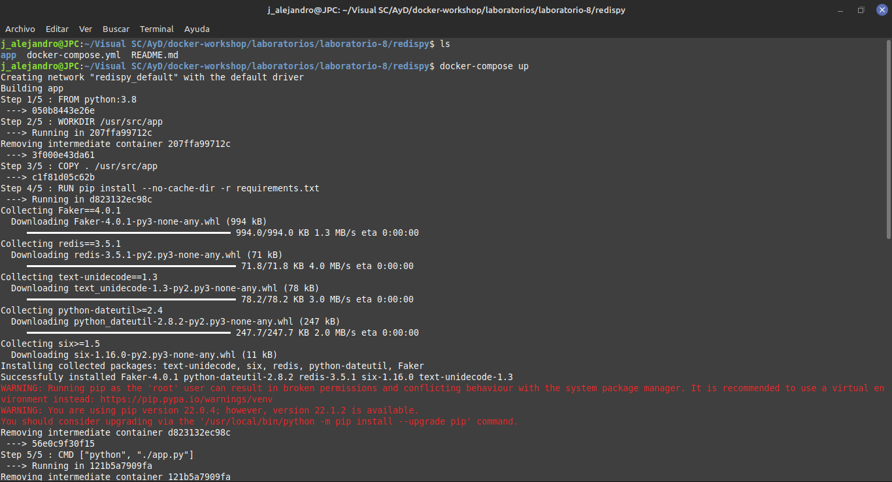
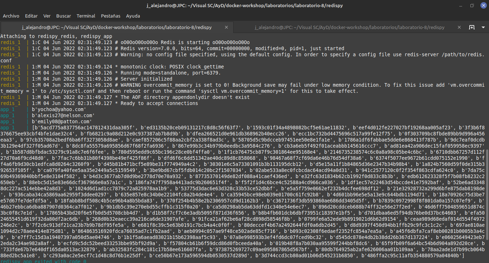
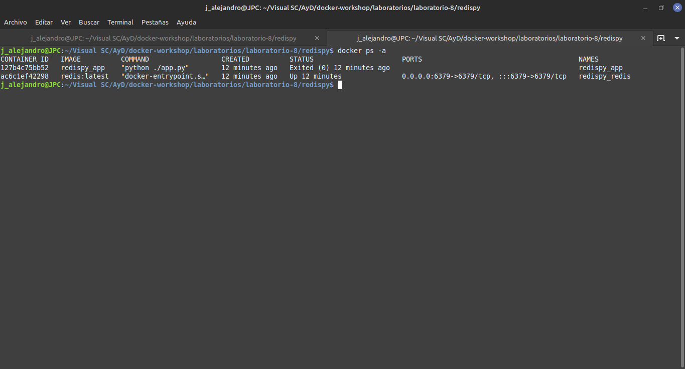
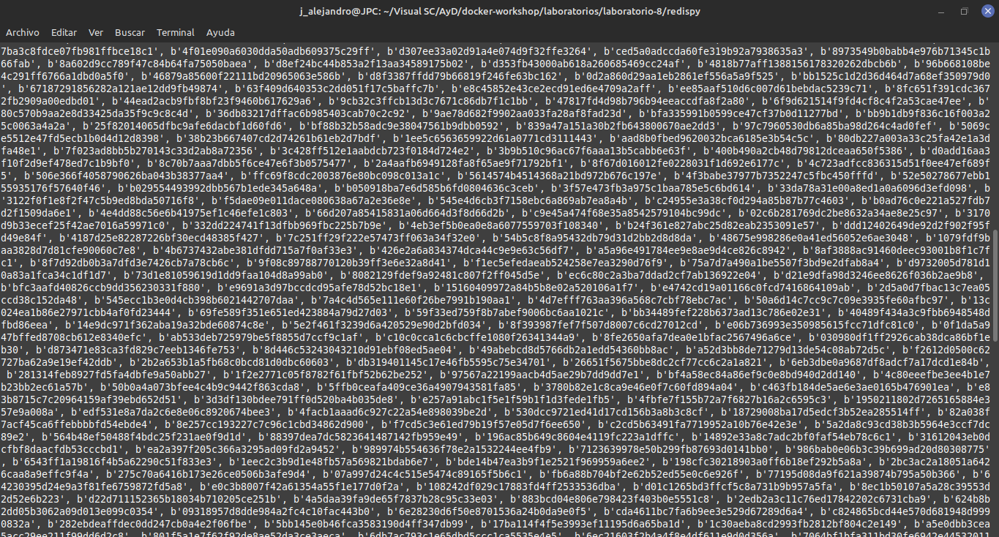
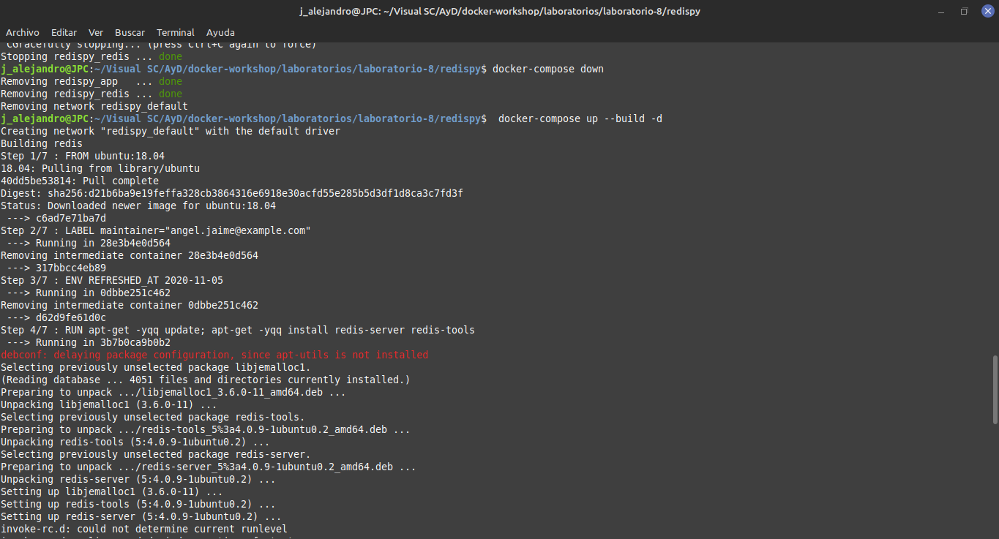

# Laboratorio 8
Utilizando Docker Compose.

Observando diferencias y ventajas a comparación de Docker Networks.

Forma más fácil y rápida de levantar imágenes,contenedores y networks.
___
## Screenshots
___

