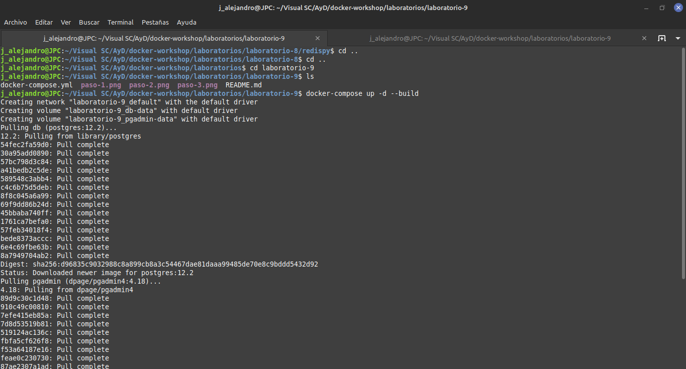
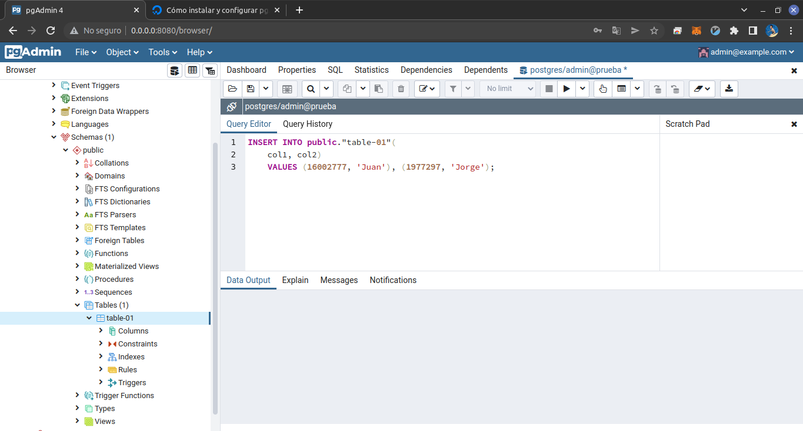
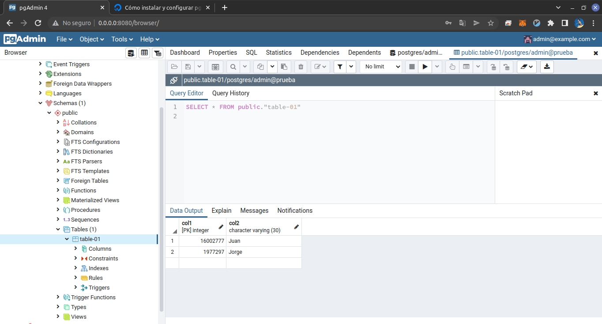
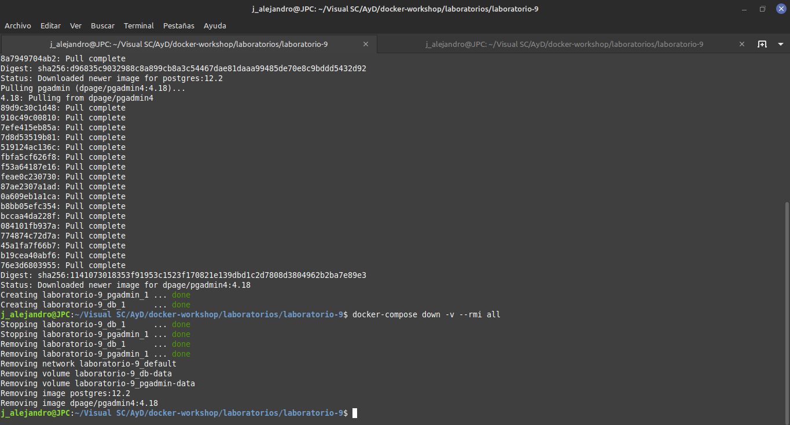

# Laboratorio 9
Contenedor de PostgreSQL que se puede visualizar a travez de pgAdmin.

Orquetasto con Docker Compose.

Creación de serve, tabla e inserción de datos en PostgreSQL.
___
## Screenshots
___

