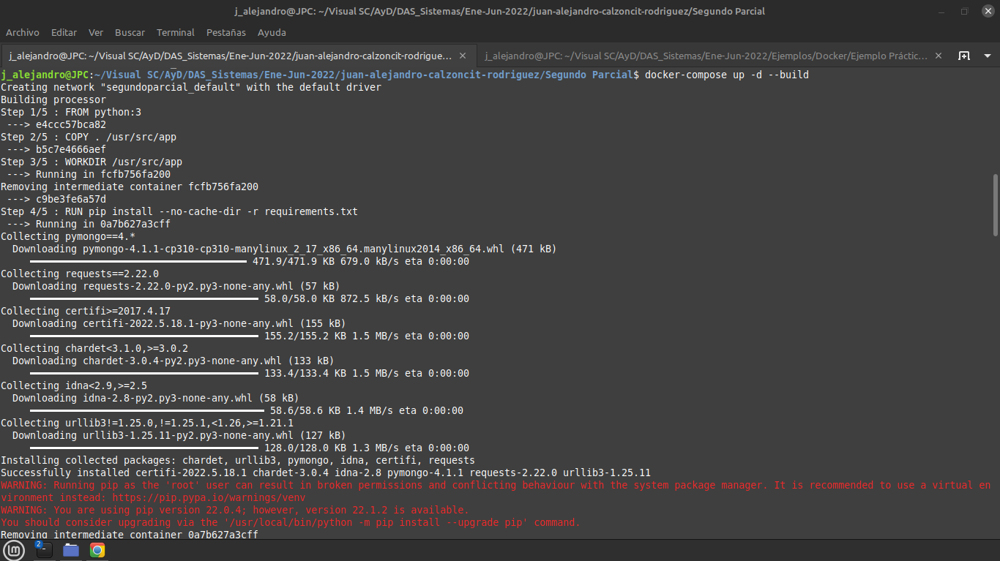
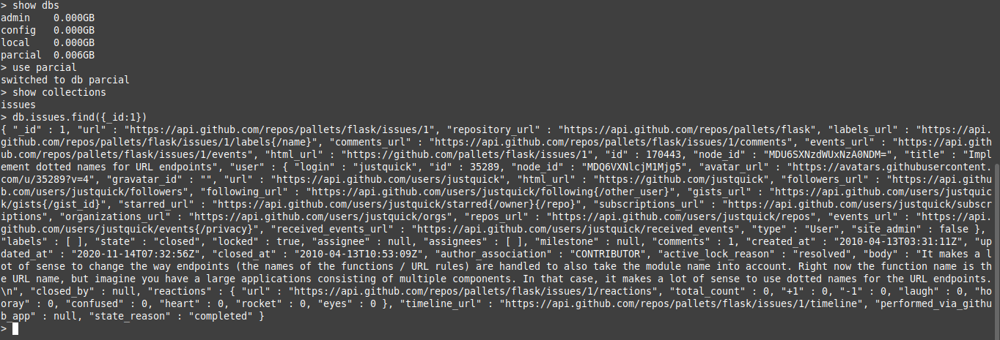
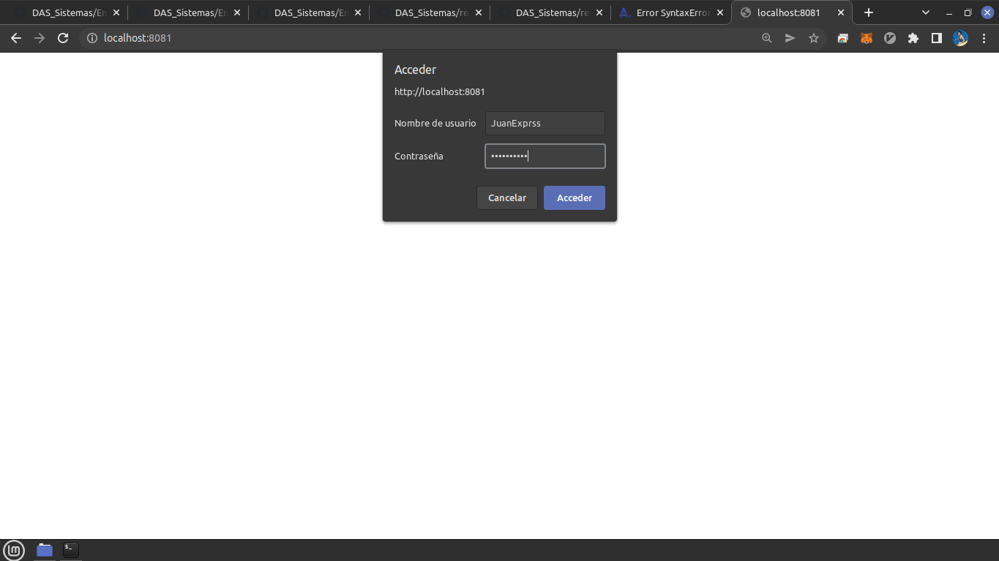
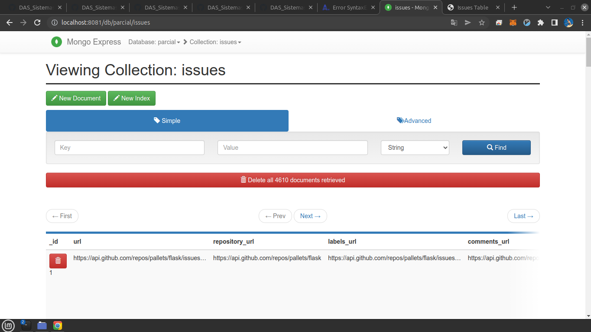
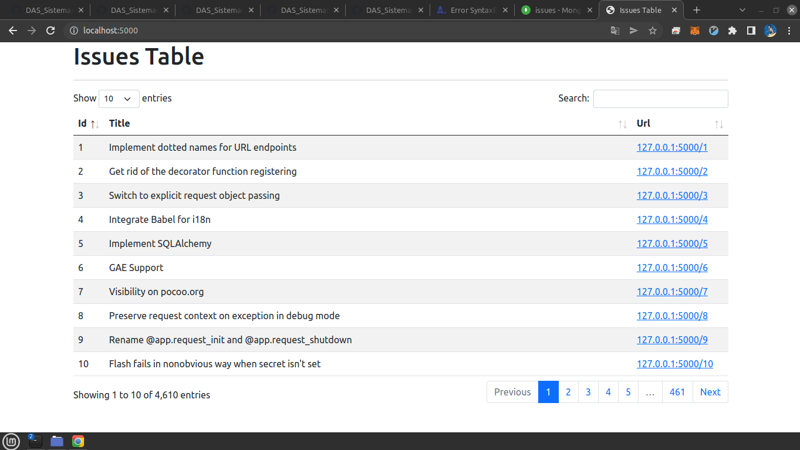
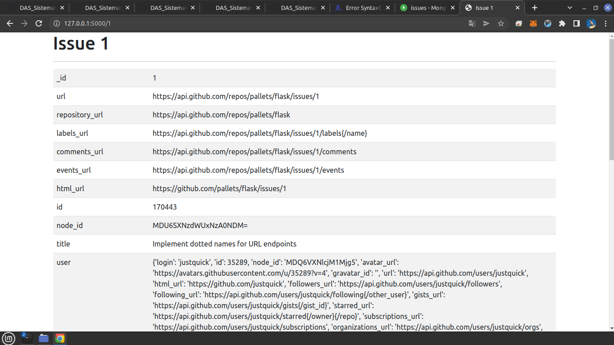

# Segundo Parcial

Los pasos para hacer funcionar está relativamente pequeña aplicaión son muy sencillos.

El unico requisito es tener [Docker](https://www.docker.com/) instalado en su equipo de cómputo.

Una vez teniendo esto, se debe de cerciorar que este en la misma carpeta en la que se encuentra el archivo [dokcer-compose](docker-compose.yml) y ejecutar el siguiente comando dentro de su terminal:

`docker-compose up -d --build`

Debería de estar viendo algo como lo siguiente:

Y con eso la aplicación se encuntra corriendo !!!.

___

Ahora puede ver los estatus de los contenedores con el comando : `docker ps -a`

Ya que la inserción del contenedor "py_procesar" tomará un rato, puede ingresar al segundo contenedor con : `docker exec -it mongo_compose /bin/bash` . Y dentro el contenedor : `mongo -u root -p contrasena123` para inicar mongo.

Si ejecuta `show dbs` observara varias dbs, entre ellas la que creamos de nombre 'parcial', con `use parcial` "usamos" la db, enseguida `show collections` para obervar las colecciones dentro de la db y ahora haremos un find al primer registro.

Observe que el primer resgitro se encuentra en la base de datos, ya que se esta usando `insert_one()` y no `insert_many()` para el recurso que obtenemos de la API.

De igual forma podemos entrar a la dirección [http://localhost:8081/](http://localhost:8081/) en el cual se esta ejecutando el segundo contenedor, que es una instancia de la imagen [Mongo-express](https://hub.docker.com/_/mongo-express)

Ingrese las credenciales 'JuanExprss' para Nombre de usuario y 'pasemeProf' para la contraseña.

Ingresamos a la db y a la colección:

Observamos que lleva 479 registros.

Cuando el primer contenedor acabe su trabajo, volvemos a ingresar y ya veremos que están los 4,610 registros esperados.

Y en este momento ya podemos entrar al puerto en donde se está ejecutando el último contenedor [http://localhost:5000/](http://localhost:8081/)

Se muestra una tabla en la cuál muestra los 10 primeros registros, y si se hace click a algun Url, nos direcciona a su paǵina individual en donde se muestra todo el contenido de este:

___
Para dejar de ejecutar ingrese `docker-compose down -v --rmi local`, el cual detrendrá los contenedores y también los borrará, al igual que las imagenes creadas.
___
## URLs

[http://localhost:8081/](http://localhost:8081/)

[http://localhost:5000/](http://localhost:8081/)