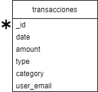

## paso a seguir para hacer funcionar el proyect
###### tener docker insatalado 
###### descargar la carpeta ordicnario 
###### abrir la terminal
###### en la traminal dirigirse a la carpeta ordinario 
###### una ves dentro de la carpeta ejecutar el comando docker-compose up -d --build
###### esperara que se creen las imagenes y el compose 
###### puede ver el video en https://drive.google.com/file/d/1XqPxccXDlxgp_X38TaVFm6BS7grlk2i1/view?usp=sharing
{withd=80%}
{withd=80%}
## link del repositorio 
https://github.com/SaulCN/ordinario